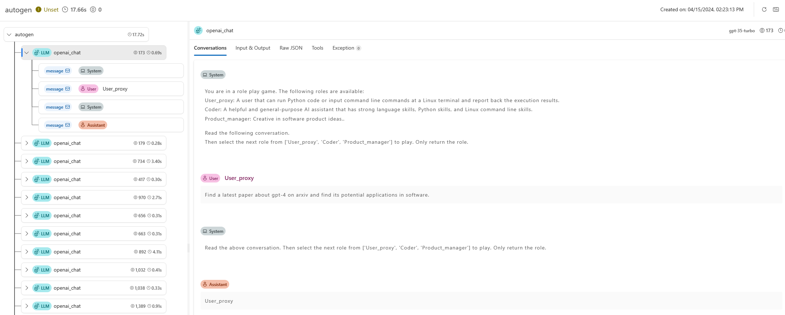
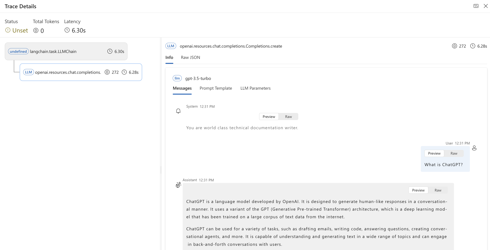

# Tracing

:::{admonition} Experimental feature
This is an experimental feature, and may change at any time. Learn [more](../faq.md#stable-vs-experimental).
:::

Prompt flow provides the trace feature to enable user to trace LLM call or function, and LLM frameworks like `LangChain` and `AutoGen`, following [OpenTelemetry specification](https://opentelemetry.io/docs/specs/otel/).

## Installing the package

```bash
pip install promptflow-tracing
```

## Instrumenting user's code

### Enable trace for LLM calls
Let's start with the simplest example, add single line code **`start_trace()`** to enable trace for LLM calls in your application.
```python
from openai import OpenAI
from promptflow.tracing import start_trace

# instrument OpenAI
start_trace()

client = OpenAI()

completion = client.chat.completions.create(
  model="gpt-4",
  messages=[
    {"role": "system", "content": "You are a poetic assistant, skilled in explaining complex programming concepts with creative flair."},
    {"role": "user", "content": "Compose a poem that explains the concept of recursion in programming."}
  ]
)

print(completion.choices[0].message)
```

Then OpenAI is instrumented, and as prompt flow follows OpenTelemetry specification, user can fully leverage the OpenTelemetry knowledge to use these traces during the OpenAI calls.

### Trace on any function
A more common scenario is the application has complicated code structure, and developer would like to add trace on critical path that they would like to debug and monitor. 

See the **[math_to_code](https://github.com/microsoft/promptflow/tree/main/examples/tutorials/tracing/math_to_code.py)** example on how to use **`@trace`**. 

Execute below command will get an URL to display the trace records and trace details of each test.

```python
from promptflow.tracing import trace

# trace your function
@trace
def code_gen(client: AzureOpenAI, question: str) -> str:
    sys_prompt = (
        "I want you to act as a Math expert specializing in Algebra, Geometry, and Calculus. "
        "Given the question, develop python code to model the user's question. "
        "Make sure only reply the executable code, no other words."
    )
    completion = client.chat.completions.create(
        model=os.getenv("CHAT_DEPLOYMENT_NAME", "gpt-35-turbo"),
        messages=[
            {
                "role": "system",
                "content": sys_prompt,
            },
            {"role": "user", "content": question},
        ],
    )
    raw_code = completion.choices[0].message.content
    result = code_refine(raw_code)
    return result
```

```shell
python math_to_code.py
```

## Trace LLM and frameworks

Prompt flow tracing works not only for general LLM application, but also for more frameworks like `autogen` and `langchain`:

1. Example: **[Add trace for LLM](https://microsoft.github.io/promptflow/tutorials/trace-llm.html)**


2. Example: **[Add trace for Autogen](https://microsoft.github.io/promptflow/tutorials/trace-autogen-groupchat.html)**



3. Example: **[Add trace for Langchain](https://microsoft.github.io/promptflow/tutorials/trace-langchain.html)**



```{toctree}
:maxdepth: 1

manage
trace-ui
```
