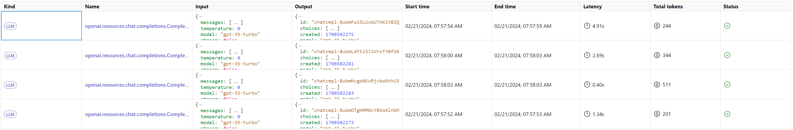
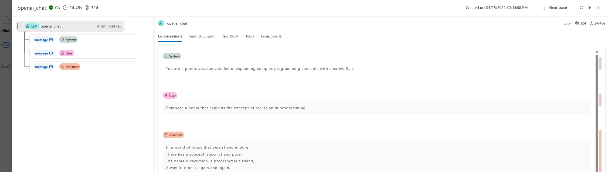
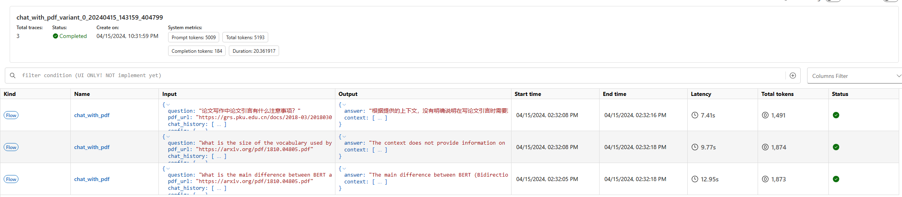
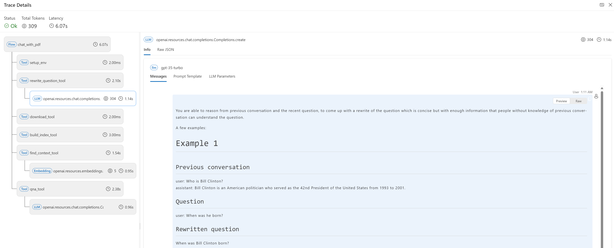
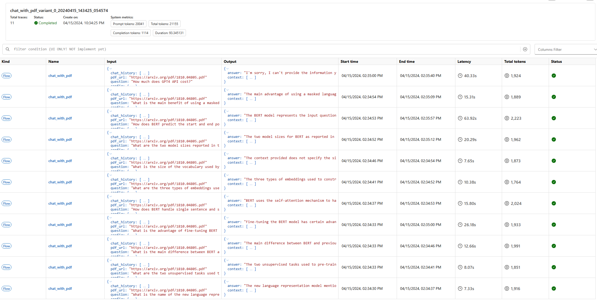
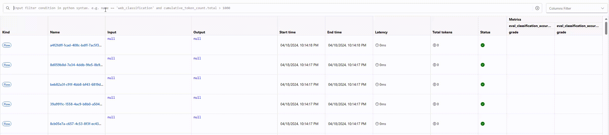

# Visualize traces

:::{admonition} Experimental feature
This is an experimental feature, and may change at any time. Learn [more](../faq.md#stable-vs-experimental).
:::

Prompt flow provides several trace toolkits in `promptflow-devkit`. This page will introduce trace UI, where user can better capture and visualize the internal execution details for flows. With trace UI, user can track and visualize flow execution, which provides critical insights for developer to understand the internal details of execution.

## Overview

With `promptflow-devkit` installed, running python script with `start_trace` will produce below example output:

```text
Prompt flow service has started...
You can view the traces from local: http://127.0.0.1:<port>/v1.0/ui/traces/?#collection=basic
```

Click the url, user will see a trace list that corresponding to each LLM calls:



Click on one line record, the LLM detail will be displayed with chat window experience, together with other LLM call params:


When combine trace and flow, trace UI provides a more comprehensive view of the flow execution, user can easily track the flow execution details, and debug the flow execution issues.

### Flow test

If your application is created with DAG flow, all flow test and batch run will be automatically enable trace function. Take the **[chat_with_pdf](https://github.com/microsoft/promptflow/tree/main/examples/flows/chat/chat-with-pdf/)** as example. 

Run `pf flow test --flow .`, each flow test will generate single line in the trace UI:



Click a record, the trace details will be visualized as tree view.



### Evaluate against batch data

Keep using **[chat_with_pdf](https://github.com/microsoft/promptflow/tree/main/examples/flows/chat/chat-with-pdf)** as example, to trigger a batch run, you can use below command under the folder (you can learn more from [Run and evaluate a flow](https://microsoft.github.io/promptflow/how-to-guides/run-and-evaluate-a-flow/index.html) to understand what does below command do):

```shell
pf run create --flow . --data "./data/bert-paper-qna.jsonl" --column-mapping chat_history='${data.chat_history}' pdf_url='${data.pdf_url}' question='${data.question}'
```

Then you will get a run related trace URL, e.g. `http://127.0.0.1:<port>/v1.0/ui/traces?run=chat_with_pdf_20240226_181222_219335`



### Search

Trace UI supports simple Python expression for search experience, which is demonstrated in below GIF:



Currently it supports:

- Operators:
  - bool: `and` and `or`
  - compare: `==`, `!=`, `>`, `>=`, `<` and `<=`
- Searchable fields:
  - metadata: `name`, `kind` and `status`
  - time: `start_time`
  - token count: `cumulative_token_count.total`, `cumulative_token_count.prompt` and `cumulative_token_count.completion`
  
You can also find the hints by clicking the button right to the search edit box:


