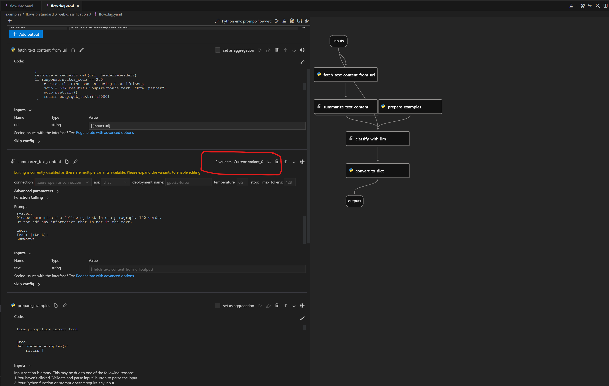
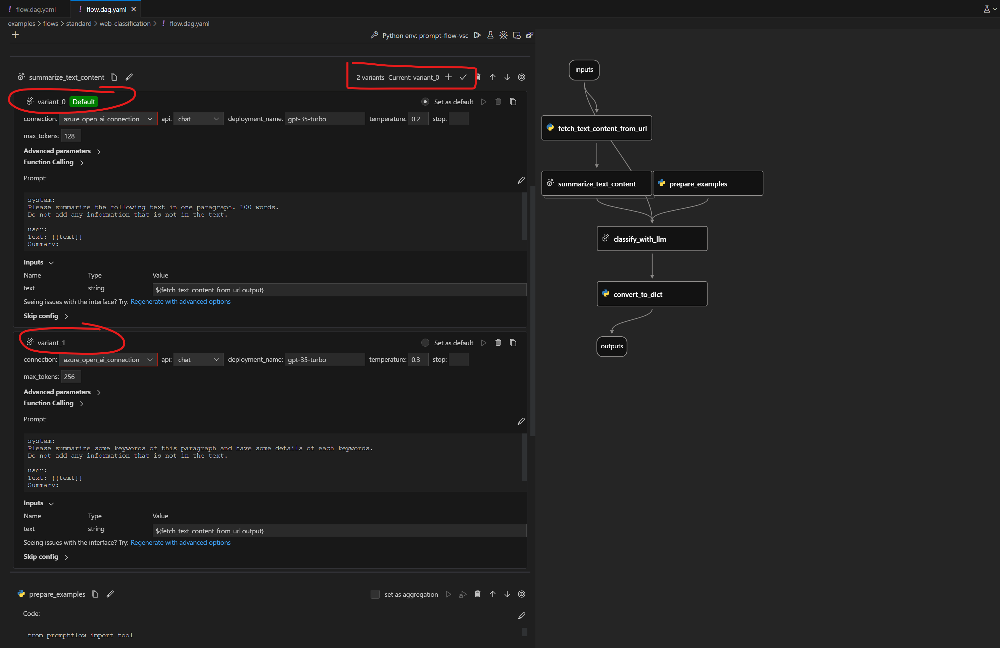

# Tune prompts using variants

:::{admonition} Experimental feature
This is an experimental feature, and may change at any time. Learn [more](https://aka.ms/azuremlexperimental).
:::

To better understand this part, please read [Quick start](./quick-start.md) and [Run and evaluate a flow](./run-and-evaluate-a-flow.md) first.

## What is variant and why should we care

In order to help users tune the prompts in a more efficient way, we introduce [the concept of variants](../../concepts/concept-variants.md) which can help you test the model’s behavior under different conditions, such as different wording, formatting, context, temperature, or top-k, compare and find the best prompt and configuration that maximizes the model’s accuracy, diversity, or coherence.

## Create a run with different variant node

 In this example, we use the flow [web-classification](https://github.com/microsoft/promptflow/tree/main/examples/flows/standard/web-classification), its node `summarize_text_content` has two variants: `variant_0` and `variant_1`. The difference between them is the inputs parameters:


```yaml
...
nodes:
- name: summarize_text_content
  use_variants: true
...
node_variants:
  summarize_text_content:
    default_variant_id: variant_0
    variants:
      variant_0:
        node:
          type: llm
          source:
            type: code
            path: summarize_text_content.jinja2
          inputs:
            deployment_name: text-davinci-003
            max_tokens: '128'
            temperature: '0.2'
            text: ${fetch_text_content_from_url.output}
          provider: AzureOpenAI
          connection: open_ai_connection
          api: completion
          module: promptflow.tools.aoai
      variant_1:
        node:
          type: llm
          source:
            type: code
            path: summarize_text_content__variant_1.jinja2
          inputs:
            deployment_name: text-davinci-003
            max_tokens: '256'
            temperature: '0.3'
            text: ${fetch_text_content_from_url.output}
          provider: AzureOpenAI
          connection: open_ai_connection
          api: completion
          module: promptflow.tools.aoai
```

You can check the whole flow definition in [flow.dag.yaml](https://github.com/microsoft/promptflow/tree/main/examples/flows/standard/web-classification/flow.dag.yaml).

Now we will create a variant run which uses node `summarize_text_content`'s variant `variant_1`. 
Assuming you are in working directory `<path-to-the-sample-repo>/examples/flows/standard`


::::{tab-set}

:::{tab-item} CLI
:sync: CLI

Note we pass `--variant` to specify which variant of the node should be running.

```sh
pf run create --flow web-classification --data web-classification/data.jsonl --variant '${summarize_text_content.variant_1}' --stream --name my_first_variant_run
```

:::

:::{tab-item} SDK
:sync: SDK

```python
from promptflow import PFClient

pf = PFClient()  # get a promptflow client
flow = "web-classification"
data= "web-classification/data.jsonl"

# use the variant1 of the summarize_text_content node.
variant_run = pf.run(
    flow=flow,
    data=data,
    variant="${summarize_text_content.variant_1}",  # use variant 1.
)

pf.stream(variant_run)
```
:::

:::{tab-item} VS Code Extension
:sync: VS Code Extension


:::

::::

After the variant run is created, you can evaluate the variant run with a evaluation flow, just like you evalute a standard flow run.

## Next steps

Learn more about:
- [Run and evluate a flow](./run-and-evaluate-a-flow.md)
- [Deploy a flow](./deploy-a-flow/index.md)
- [Prompt flow in Azure AI](../cloud/azureai/quick-start.md)