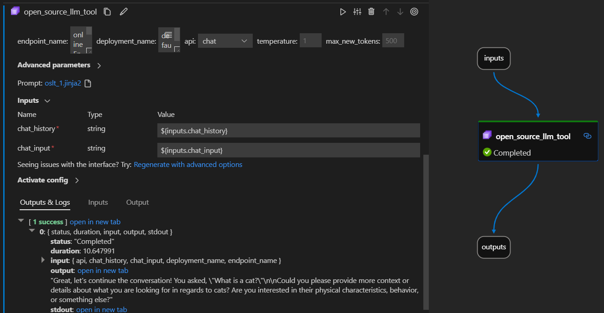

# Open Source LLM

## Introduction

The Prompt flow Open Source LLM tool enables you to utilize a variety of Open Source and Foundational Models, such as [Falcon](https://aka.ms/AAlc25c) or [Llama 2](https://aka.ms/AAlc258) for natural language processing, in PromptFlow.

Here's how it looks in action on the Visual Studio Code Prompt flow extension. In this example, the tool is being used to call a LlaMa-2 chat endpoint and asking "What is CI?".

This Prompt flow supports two different LLM API types:

- **Chat**: Shown in the example above. The chat API type facilitates interactive conversations with text-based inputs and responses.
- **Completion**: The Completion API type is used to generate single response text completions based on provided prompt input.

## Quick Overview: How do I use Open Source LLM Tool?

1. Choose a Model from the AzureML Model Catalog and deploy.
2. Setup and select the connections to the model deployment.
3. Configure the tool with the model settings.
4. Prepare the Prompt with [guidance](./prompt-tool.md#how-to-write-prompt).
5. Run the flow.

## Prerequisites: Model Deployment

1. Pick the model which matched your scenario from the [Azure Machine Learning model catalog](https://ml.azure.com/model/catalog).
2. Use the "Deploy" button to deploy the model to a AzureML Online Inference endpoint.

More detailed instructions can be found here [Deploying foundation models to endpoints for inferencing.](https://learn.microsoft.com/en-us/azure/machine-learning/how-to-use-foundation-models?view=azureml-api-2#deploying-foundation-models-to-endpoints-for-inferencing)

## Prerequisites: Prompt flow Connections

In order for Prompt flow to use your deployed model, you will need to setup a Connection. Explicitly, the Open Source LLM tool uses the CustomConnection.

1. Instructions to create a Custom Connection [can be found here.](https://microsoft.github.io/promptflow/how-to-guides/manage-connections.html#create-a-connection)

    The keys to set are:

    1. **endpoint_url**
        - This value can be found at the previously created Inferencing endpoint.
    2. **endpoint_api_key**
        - Ensure to set this as a secret value.
        - This value can be found at the previously created Inferencing endpoint.
    3. **model_family**
        - Supported values: LLAMA, DOLLY, GPT2, or FALCON
        - This value is dependent on the type of deployment you are targetting.

## Running the Tool: Inputs

The Open Source LLM tool has a number of parameters, some of which are required. Please see the below table for details, you can match these to the screen shot above for visual clarity.

| Name | Type | Description | Required |
|------|------|-------------|----------|
| api | string | This is the API mode and will depend on the model used and the scenario selected. *Supported values: (Completion \| Chat)* | Yes |
| endpoint_name | string | asdasd | No |
| connection | CustomConnection | This is the name of the connection which points to the Online Inferencing endpoint. | No |
| temperature | float | The randomness of the generated text. Default is 1. | No |
| max_new_tokens | integer | The maximum number of tokens to generate in the completion. Default is 500. | No |
| top_p | float | The probability of using the top choice from the generated tokens. Default is 1. | No |
| model_kwargs | dictionary | This input is used to provide configuration specific to the model used. For example, the Llama-02 model may use {\"temperature\":0.4}. *Default: {}* | No |
| deployment_name | string | The name of the deployment to target on the Online Inferencing endpoint. If no value is passed, the Inferencing load balancer traffic settings will be used. | No |
| prompt | string | The text prompt that the language model will use to generate it's response. | Yes |

## Outputs

| API        | Return Type | Description                              |
|------------|-------------|------------------------------------------|
| Completion | string      | The text of one predicted completion     |
| Chat       | string      | The text of one response int the conversation |
