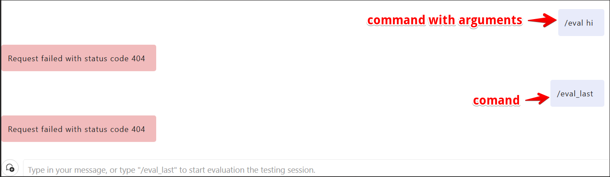
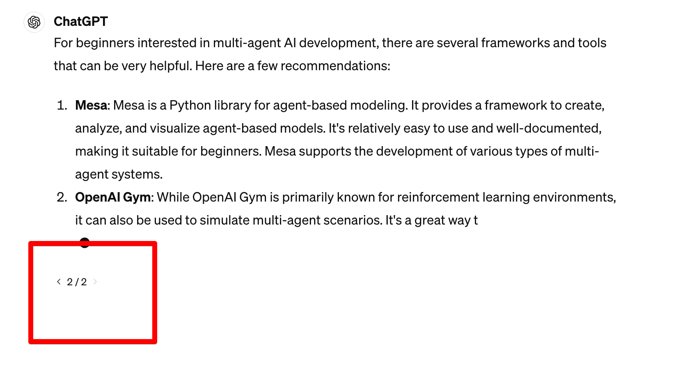

# user pain points

- have to wrap my code to a flex flow 

  - Have to write an entry function and reorignize my code. 

  - Can only send messages as chat input in the function arguments. Usually I intend to bind one of the argument to the Chat APP input box, however I am able to do that in my code.

  - Can only reply messages in return values. It has to be a dict and serializable. And I need to collect all the messages I want to respond in the Chat APP and merge them into one object, which is not readable in the Chat UI.

- Hard to chat with stateful agents.

  - Cannot pass stateful assistant thread, agents in the chat_history

- Cannot register more chat inline interactions.

- Cannot control the right panel on my purpose. For example, I want a toggle button to enable or disable code interpreter, but could not.


# Dev pain points

- Need redundant efforts for dag flow, flex flow, prompty, etc.


# Experience brainstorming

## Basic - start a chat window on local browser

Pure Python:

```python
from promptflow.devkit import start_chat

my_chat = start_chat()
# optional arguments 
my_chat = start_chat(port=8001, window="my_chat", browser="~/Library/Application Support/Google/Chrome")
```

Vanilla TypeScript

```typescript
import { Chat } from "@promptflow/chat";

const myChat = new Chat({
    port: 8001, // optional
    window: "my_chat", // optional
    browser: "~/Library/Application Support/Google/Chrome" // optional
});

await myChat.start();
```


With prompt flow integration:

- Should stay the same with today. 

  ```bash
  pf flow test --flow some/path --ui # pf should automatically start chat window when --ui specified
  
  pf flow test --flow some/path --ui port=8001 name="my chat" browser="~/Library/Application Support/Google/Chrome" # optional parameters aligned with code experience
  ```


## Basic - terminal a chat

- User can use keyboard interruption with ctrl+c in the console.

- User can close the browser tab of the chat.

- User can click the "x" on the chat of the left pane

  

- Users can programmatically terminate the chat.

  ```python
  my_chat.terminate()
  ```

  ```typescript
  await myChat.terminate();
  ```

- Users are able to subscribe the terminate events

  ```py
  from promptflow.devkit import start_chat
  
  my_chat = start_chat
  
  def on_terminate_chat(reason: str):
      print(f"chat terminated: {reason}") # chat terminated: keyboardInterrupt
  
  my_chat.on_terminate(on_terminate_chat)
  ```
  
  ```typescript
  import { Chat, EventType } from "@promptflow/chat";
  
  new Chat()
  	.start()
  	.onEvent(evt => {
      	if (evt === EventType.Terminate) {
          	console.log(evt.reason); // "KeyboardInterrupt"
      	}
  	})
  ```
  
  
  

## Basic - receive a message from the Chat window, and send replies.

​        

Handle message in code:

```python
from promptflow.devkit import start_chat, Chat

my_chat = start_chat()

def handle_message(message: Chat.Message):
    bot = new Chat.Profile(name="Bot")
    # simple message
    my_chat.send(message=f"received message: {message.content} from: {message.from.name} at: {message.created_at}", from=bot)
        
my_chat.on_message(handle_message)
```

```typescript
import { Chat, ChatMessage, ChatProfile, MessageServerity, MessageIntent } from "@promptflow/chat";
import { botIcon } from "some_awesome_icon_lib"

const bot: ChatProfile = { 
    name: "Bot",
    icon: botIcon,
    tags: ["The assistant champion", "Your helpful friend"]
};
const myChat = new Chat()
  .onMessage(async (message: ChatMessage) => {
    await myChat.send(
      {
        message: `Hello ${message.from.name}! We received your message: ${message.content}`, 
        from: bot
      }
    );    
  });

await chat.start();

```

Please refer to the advanced - rich content message section for more complex messages.

## Advanced - Chat life cycle

- start
- terminate

```python
from promptflow.devkit import start_chat
import json

my_chat = start_chat()

def on_chat_start(options)
	  print("Chat starts")
    print(json.dump(opsions))

def on_terminate_chat(reason: str):
    print(f"chat terminated: {reason}") # chat terminated: keyboardInterrupt
    
my_chat.on_start(handle_chart_start)
my_chat.on_terminate(handle_chart_terminate)
```

```typescript
import { Chat, EventType } from "@promptflow/chat";

const myChat = new Chat({ port: 8001 })
	.onEvents(evt => {
        switch (evt.type) {
            case EventType.Terminate:       
                console.log(evt.reason); // KeyboardInterrupt
                break;
            case EventType.Start:
                console.log(evt.options); // { port: 8001 }
                break;
            default:
                console.log(evt);
        }
    });
```

## Advanced - Right panel on the Chat UI


```py
from promptflow.devkit import start_chat, Chat

my_chat = start_chat()

settings_form_json_schema = '''
{
  "type": "object",
  "properties": {
    "inputs": {
      "type": "object",
      "properties": {
        "text": {
          "type": "string",
          "default": "test"
        }
      }
    },
    "outputs": {
      "type": "object",
      "properties": {
        "output": {
          "type": "string"
        }
      }
    },
    "init": {
      "type": "object",
      "properties": {
        "init_key": {
          "type": "string"
        }
      }
    }
  }
}
'''

@Chat.json_schema_panel(name="Settings", icon=None, schema=settings_form_json_schema)
def handle_settings_change(value: Dict, changedKey: str):
    print(f"{changedKey} changed. New value is {value[changedKey]}")
    
@Chat.editor_panel(name="experiment", icon=None, syntax="yaml")
def handle_experiments_yaml_change(text: str)
	print(text)
    
my_chat.add_right_panels([handle_settings_change, ])
```

```typescript
import { Chat, RightPanelType } from "@promptflow/chat"

const schema = `
{
  "type": "object",
  "properties": {
    "inputs": {
      "type": "object",
      "properties": {
        "text": {
          "type": "string",
          "default": "test"
        }
      }
    },
    "outputs": {
      "type": "object",
      "properties": {
        "output": {
          "type": "string"
        }
      }
    },
    "init": {
      "type": "object",
      "properties": {
        "init_key": {
          "type": "string"
        }
      }
    }
  }
}
`;

const myChat = new Chat()
	.withRightPanel({
        type: RightPanelType.JSONSchemaForm,
        name: "Settings",
   		schema,
        onChange(evt) {
            console.log(evt.data); // { value: "xxx", changedKey: "abc" }
        }
    })
	.withRightPanel({
        type: RightPanelType.Editor,
        name: "experiment",
        syntax: "yaml",
        onChange(evt) {
            console.log(evt.data); // { value: "xxx" }
        }
    })
```


## Advanced - Commands



User can enable the command features.

After turning on the commands feature, the message start with "/" will not trigger the on_message callback. Instead the chat app will look up the commands and invoke the callback.

UI will provide auto-complete and highlights for commands.

```python
from promptflow.devkit import start_chat, Chat

my_chat = start_chat()

@Chat.command("eval")
def eval_commmand():
    print("handling /eval command")
    
@Chat.command("eval_last")
def eval_last_command(args: str):
    print(f"handling /eval_last command. Arguments are: {args} ")

my_chat.enable_commands([eval_command, eval_last_command])


```

```typescript
import { Chat, ChatCommand } from "@promptflow/chat";

const myChat = new Chat();
const commands: Array<ChatCommand> = [
  {
    key: "eval",
    exactMatches: "eval",
    handler: () => console.log("handling \/eval command");
  },
  {
    key: "eval_last",
    exactMatches: "eval_last",
    handler: args => consle.log(`handling /eval_last, ${args}`);
  }
]

myChat.enableCommands()

await myChat.start();
```


## Advanced - rich content messages

```python
from promptflow.devkit import start_chat, Chat

my_chat = start_chat()

def handle_message(message: Chat.Message):
    bot = new Chat.Profile(name="Bot")
    # simple message
    my_chat.send(message=f"received message: {message.content} from: {message.from.name} at: {message.created_at}", from=bot)
    
    # additional links
    doc_site_link = new Chat.message_link(
    	label="visit our doc site",
      url="https://microsoft.github.io/promptflow",
      open_new_tab=true
    )
    my_chat.send(
      messsage=new Chat.TextMessage(text=f"Hello! {message.from.name}", links=[doc_site_link]),
    	from=bot
    )
    
    # additional action
    def view_trace():
        my_chat.send(
          	message=new Chat.HTMLMessage(file=".trace_detail.html", position="center")
        		from=bot
        )
    
    view_trace_action = new Chat.message_action(
    		label: "view_trace",
      	icon: "trace.png",
        appearance: "link",
        posistion: "bottom",
        handler: view_trace
    )
    my_chat.send(
      	message=new Chat.TextMessage(text=f"Hello! {message.from.name}", actions=[view_trace_action])
    		from=bot
    )
    try:
        # do some dangerous things
    except:
        # intent: normal(default, no effects), error(red background), congrats(fireworks animation), serverity: normal, low, high
        error_message = new Chat.TextMessage(text="Opps! An error occurred", intent="error", serverity="high")
        # using HTML template engine to build complex reply message
        error_detail_message = new Chat.JadeTemplateMessage(template="./error_page.jade", parameters={ "error_detail": "Internal error." })
        # Nested message
        error_message.append_child(child=error_detail_message, indent=80)
        my_chat.send(
          	message=error_message
          	from=bot
        )
        

my_chat.on_message(handle_message)
```

```typescript
import { 
    Chat,
    ChatProfile,
    MessageServerity,
    MessageIntent,
    TextMessage,
    HTMLMessage
} from "@promptflow/chat";
import { botIcon, viewIcon } from "some_awesome_icon_lib"

const bot: ChatProfile =  
    name: "Bot",
    icon: botIcon,
    tags: ["The assistant champion", "Your helpful friend"]
};

const myChat = new Chat()
  .onMessage(async (message: ChatMessage) => {
    await myChat.send(
      {
        message: `Hello ${message.from.name}! We received your message: ${message.content}`,
        from: bot
      }
    );
    
    // construct complex message
    await myChat.send(
      {
        message: {
          text: `Hello ${message.from.name}! We received your message: ${message.content}`,
          links: [
              {
                  label: "visit doc site",
                  url: "https://microsoft.github.io/promptflow/"
              }
          ],
          actions: [
              {
                  label: "view trace",
                  icon: viewIcon,
                  as: "icon",
                  onClick: async () => {
                      await bot.send({
                          html: `<html>contents</html>`,
                          position: "center"
                      } satisfies HTMLMessage
                      );
                  }
              }
          ]
    	 } satisfies TextMessage,
       from: bot
    );
      
    // shorthands for intent
    await myChat.sendCongrats({
        message: "Your first chat app works as a charm",
        from: bot
    }); // fireworks on the screen :)
      
    // builder pattern for message
    const nestedMessage = TextMessage.builder
        	.withContent("Opps, an error occurred!")
    			.withServerity(MessageServerity.High) // Big red sign signal !
          .withIntent(MessageIntent.Error) // message with red background
        	.withChild(
            	HTMLMessage.builder
                	.withJadeTemplate(```
!!! 5
html(lang="en")
  head
    title= pageTitle(car insurance montana)
    :javascript
      | if (foo) {
      |    bar()
      | }
  body
    h1 Jade - node template engine 
    #container
      - if (youAreUsingJade)
         You are amazing
      - else
         Get on it!
         Get on it!
         Get on it!
         Get on it!
                	```)
                	.withParameters({
                        foo: "bar"
                    })
                	.position("left")
            )
	        .withChildIndent(80)
        	.build();
    
    await myChat.send({
      	message: nestedMessage,
      	from: bot
    });  
  });

await chat.start();
```

## Advanced - message actions and user feedback

```python
from promptflow.devkit import start_chat, Chat

my_chat = start_chat()
bot = new Chat.Profile(name="bot")

def user_thumb_up():
    print("user loves it!")
    
thumb_up_action = new Chat.message_action(
  label="like", # REQUIRED! if appearance is "icon-only", will apply the label to tooltips and aria-label for screen releases
  apperance="icon-only", # icon-only, link, button
  icon="thumbup.png",
  position="bottom-right,
	handler=user_thumb_up
)

message_with_user_feedback = new Chat.text_message(
	text="This is a test message",
  actions=[thumb_up_action]
)

my_chat.send(
		message=message_with_user_feedback
  	from=bot
)

```


## Advanced - nested message


```python
from promptflow.devkit import start_chat, Chat

my_chat = start_chat()

def handle_message(message: Chat.Message):
    error_message = new Chat.TextMessage(text="Opps! An error occurred", intent="error", serverity="high")
    error_detail_message = new Chat.JadeTemplateMessage(template="./error_page.jade", parameters={ "error_detail": "Internal error." })
    # Nested message
    error_message.append_child(child=error_detail_message, indent=80)
    my_chat.send(message=error_message)
        
my_chat.on_message(handle_message)
```

```typescript
import { 
    Chat,
    ChatProfile,
    MessageServerity,
    MessageIntent,
    TextMessage,
    HTMLMessage
} from "@promptflow/chat";
import { botIcon, viewIcon } from "some_awesome_icon_lib"

const bot: ChatProfile = { 
    name: "Bot",
    icon: botIcon,
    tags: ["The assistant champion", "Your helpful friend"]
};
const myChat = new Chat()
  .onMessage(async (message: ChatMessage) => {    
    // builder pattern for message
    await myChat.send(
      {
        message: TextMessage.builder
        	.withContent("Opps, an error occurred!")
    			.withServerity(MessageServerity.High) // Big red sign signal !
          .withIntent(MessageIntent.Error) // message with red background
        	.withChild(
            	HTMLMessage.builder
                	.withJadeTemplate(```
!!! 5
html(lang="en")
  head
    title= pageTitle(car insurance montana)
    :javascript
      | if (foo) {
      |    bar()
      | }
  body
    h1 Jade - node template engine 
    #container
      - if (youAreUsingJade)
         You are amazing
      - else
         Get on it!
         Get on it!
         Get on it!
         Get on it!
                	```)
                	.withParameters({
                        foo: "bar"
                    })
                	.position("left")
            )
	        .withChildIndent(80)
        	.build(),
        from: bot
      }    
    )
    
  });

await chat.start();
```


## Advanced - Resend message



```python
from promptflow.devkit import start_chat, Chat

my_chat = start_chat()
bot = new Chat.Profile(name="bot")
message_ref = bot.send("This is message 1")
bot.resend(message="This is regenerated message", append_to=message_ref)
```

```typescript
import { Chat, ChatProfile } from "@promptflow/chat";

const myChat = new Chat();
const bot = new ChatProfile();

const messageRef = await myChat.send({
  message: "This is message 1",
  from: bot
});
await myChat.resend({
  message: "This is regenerated message", 
  from: bot,
  messageRef
});


```

## Advanced - A/B testing


```python
from promtpflow.devkit import start_chat, Chat

my_chat = start_chat()
bot = new Chat.Profile()

test_ref = my_chat.send_ab_testing_message(message_a = "Candidate 1", message_b = new Chat.HTMLMessage(html="xxx"), from: bot)

def handle_user_vote(preferred: str):
  	print(preferred); # A

test_ref.on_select(handle_user_vote)

```

```typescript
import { Chat, ChatProfile, ChatMessage } from "@promptflow/chat";

const myChat = new Chat();
const bot: ChatProfile = {
  name: "bot"
};

await myChat.sendABTestingMessage({
  messages: [
  	"Candidate message A",
    "Candidate messasge B" 
  ] satisfies Array<string | ChatMessage>,
  from: bot,
  onVote: preferred => console.log(preferred)
})

await myChat.start();


```

## Advanced - Streaming

```python
from typing_extensions import override
from openai import AssistantEventHandler
from promptflow.devkit import start_chat, Chat

my_chat = start_chat()
assistant = new Chat.Profile(name="assistant") 
# First, we create a EventHandler class to define
# how we want to handle the events in the response stream.
 
class EventHandler(AssistantEventHandler):    
  @override
  def on_text_created(self, text) -> None:
    my_chat.create_message_stream(id="xxx", from=assistant)
      
  @override
  def on_text_delta(self, delta, snapshot):
    stream = my_chat.retrieve_message_stream(id="xxx")
    stream.append(delta)
  
  @override
  def on_complete(self):
    stream = my_chat.retrieve_message_strem(id="xxx")
    stream.complete()
    
  @override
  def on_cancel(self):
    stream = my_chat.retrieve_message_strem(id="xxx")
    stream.abort(reason="cancelled!")
 
with client.beta.threads.runs.stream(
  thread_id=thread.id,
  assistant_id=assistant.id,
  instructions="Please address the user as Jane Doe. The user has a premium account.",
  event_handler=EventHandler(),
) as stream:
  stream.until_done()
```

