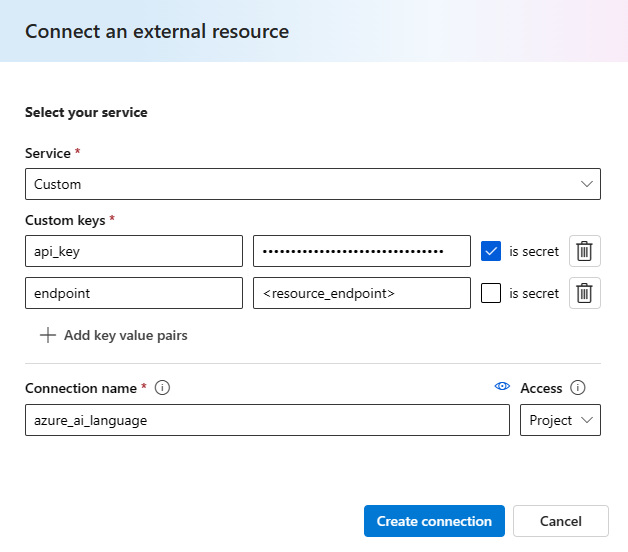
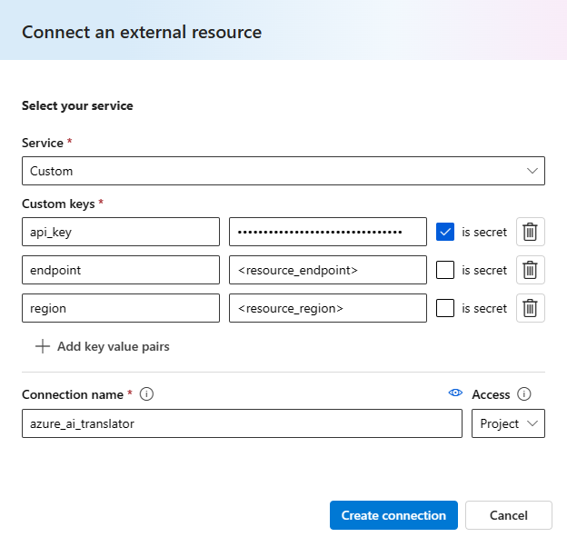

# Analyze Documents

A flow that analyzes documents with various language-based Machine Learning models.

This sample flow utilizes Azure AI Language's pre-built and optimized language models to perform various analyses on documents. It performs:
- [Translation](https://learn.microsoft.com/en-us/rest/api/cognitiveservices/translator/translator/translate?view=rest-cognitiveservices-translator-v3.0&tabs=HTTP)
- [Personally Identifiable Information (PII) detection](https://learn.microsoft.com/en-us/azure/ai-services/language-service/personally-identifiable-information/overview)
- [Named Entity Recognition (NER)](https://learn.microsoft.com/en-us/azure/ai-services/language-service/named-entity-recognition/overview)
- [Document Summarization](https://learn.microsoft.com/en-us/azure/ai-services/language-service/summarization/overview?tabs=document-summarization)
- [Sentiment Analysis & Opinion Mining](https://learn.microsoft.com/en-us/azure/ai-services/language-service/sentiment-opinion-mining/overview?tabs=prebuilt)

See the [`promptflow-azure-ai-language`](https://pypi.org/project/promptflow-azure-ai-language/) tool package reference documentation for further information.

Tools used in this flow:
- `python` tool.
- `translator` tool from the `promptflow-azure-ai-language` package.
- `pii_entity_recognition` tool from the `promptflow-azure-ai-language` package.
- `abstractive_summarization` tool from the `promptflow-azure-ai-language` package.
- `extractive_summarization` tool from the `promptflow-azure-ai-language` package.
- `entity_recognition` tool from the `promptflow-azure-ai-language` package.
- `sentiment_analysis` tool from the `promptflow-azure-ai-language` package.

Connections used in this flow:
- `Custom` connection (Azure AI Language).
- `Custom` connection (Azure AI Translator).

## Prerequisites

### Prompt flow SDK:
Install promptflow sdk and other dependencies:
```
pip install -r requirements.txt
```

Note: when using the Prompt flow SDK, it may be useful to also install the [`Prompt flow for VS Code`](https://marketplace.visualstudio.com/items?itemName=prompt-flow.prompt-flow) extension (if using VS Code).


### Azure AI/ML Studio:
Start an compute session. Required packages will automatically be installed from the `requirements.txt` file.

## Setup connections
To use the `promptflow-azure-ai-language` package, you must have an [Azure AI Language Resource](https://azure.microsoft.com/en-us/products/ai-services/ai-language). [Create a Language Resource](https://portal.azure.com/#create/Microsoft.CognitiveServicesTextAnalytics) if necessary. From your Language Resource, obtain its `api_key` and `endpoint`.

Create a connection to your Language Resource. The connection uses the `CustomConnection` schema:

### Prompt flow SDK:
```
# Override keys with --set to avoid yaml file changes
pf connection create -f ./connections/azure_ai_language.yml --set secrets.api_key=<your_api_key> configs.endpoint=<your_endpoint> name=azure_ai_language
```
Ensure you have created the `azure_ai_language` connection:
```
pf connection show -n azure_ai_language
```

### Azure AI/ML Studio:
If using Azure AI Studio, you will need to add two additional custom keys to the connection. Follow these [instructions](https://learn.microsoft.com/en-us/azure/ai-studio/how-to/prompt-flow-tools/python-tool#create-a-custom-connection)  when creating a `CustomConnection`.



To use the `translator` tool, you must have an [Azure AI Translator resource](https://azure.microsoft.com/en-us/products/ai-services/ai-translator). [Create a Translator resource](https://learn.microsoft.com/en-us/azure/ai-services/translator/create-translator-resource) if necessary. From your Translator Resource, obtain its `api_key`, `endpoint`, and `region` (if applicable).

Create a connection to your Translator Resource. The connection uses the `CustomConnection` schema:

### Prompt flow SDK:
```
# Override keys with --set to avoid yaml file changes
pf connection create -f ./connections/azure_ai_translator.yml --set secrets.api_key=<your_api_key> configs.endpoint=<your_endpoint> configs.region=<your_region> name=azure_ai_translator
```
Ensure you have created the `azure_ai_translator` connection:
```
pf connection show -n azure_ai_translator
```

### Azure AI/ML Studio:
If using Azure AI Studio, you will need to add two additional custom keys to the connection. Follow these [instructions](https://learn.microsoft.com/en-us/azure/ai-studio/how-to/prompt-flow-tools/python-tool#create-a-custom-connection)  when creating a `CustomConnection`.



Note: if you already have an Azure AI Language or Azure AI Translator connection, you do not need to create additional connections and may substitute them in.

## Run flow

### Prompt flow SDK:

#### Run with single line input
```
# Test with default input values in flow.dag.yaml:
pf flow test --flow .
# Test with specific input:
pf flow test --flow . --inputs document_path=<path_to_txt_file> language=<document_language_code>
```

#### Run with multiple lines of data
```
pf run create --flow . --data ./data.jsonl --column-mapping document_path='${data.document_path}' language='${data.language}' --stream
```
You can also skip providing column-mapping if provided data has same column name as the flow. Reference [here](https://microsoft.github.io/promptflow/how-to-guides/run-and-evaluate-a-flow/use-column-mapping.html) for default behavior when column-mapping not provided in CLI.

### Azure AI/ML Studio:
Run flow.

## Flow Description
The flow first reads in a text file and translates it to the input language. PII information is then redacted. From the redacted text, the flow generates summaries (extractive & abstractive) and extracts named entities. Finally, the flow analyzes the sentiment of the abstractive summary.

Note: you may remove all references to Azure AI Translator (connection and tool) if you do not wish to utilize those capabilities.

This flow showcases a variety of analyses to perform on documents. Consider extending it to summarize project documents or press releases, analyze and mine the sentiment of reviews, etc.


## Contact
Please reach out to Azure AI Language (<taincidents@microsoft.com>) with any issues.