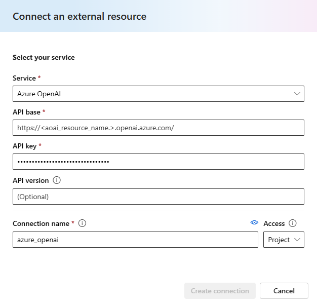

# Multi Intent Conversational Language Understanding

A flow that can be used to determine multiple intents in a user query leveraging an LLM with Conversational Language Understanding.

This sample flow utilizes Azure AI Language's Conversational Language Understanding (CLU) to analyze conversational intents. It performs:

- Breakdown of compound multi-intent user queries into single user queries using an LLM.
- [Conversational Language Understanding](https://learn.microsoft.com/en-us/azure/ai-services/language-service/conversational-language-understanding/overview) on each of those single user queries.

See the [`promptflow-azure-ai-language`](https://pypi.org/project/promptflow-azure-ai-language/) tool package reference documentation for further information.

Tools used in this flow:
- `LLM` tool.
- `conversational_language_understanding` tool from the `promptflow-azure-ai-language` package.

Connections used in this flow:
- `AzureOpenAI` connection (LLM Rewrite).
- `Custom` connection (Azure AI Language).

## Prerequisites

### Prompt flow SDK:
Install promptflow sdk and other dependencies:
```
pip install -r requirements.txt
```

Note: when using the Prompt flow SDK, it may be useful to also install the [`Prompt flow for VS Code`](https://marketplace.visualstudio.com/items?itemName=prompt-flow.prompt-flow) extension (if using VS Code).

### Azure AI/ML Studio:
Start an compute session. Required packages will automatically be installed from the `requirements.txt` file.

## Setup connections
To use the `llm` tool, you must have an [Azure OpenAI Service Resource](https://learn.microsoft.com/en-us/azure/ai-services/openai/how-to/create-resource?pivots=web-portal). Create one if necessary. From your Azure OpenAI Service Resource, obtain its `api_key` and `endpoint`.

Create a connection to your Azure OpenAI Service Resource. The connection uses the `AzureOpenAIConnection` schema:

### Prompt flow SDK:
```
# Override keys with --set to avoid yaml file changes
pf connection create -f ./connections/azure_openai.yml --set api_key=<resource_api_key> api_base=<resource_api_base> name=azure_openai
```
Ensure you have created the `azure_openai` connection:
```
pf connection show -n azure_openai
```
### Azure AI/ML Studio:



To use the `promptflow-azure-ai-language` package, you must have an [Azure AI Language Resource](https://azure.microsoft.com/en-us/products/ai-services/ai-language). [Create a Language Resource](https://portal.azure.com/#create/Microsoft.CognitiveServicesTextAnalytics) if necessary. From your Language Resource, obtain its `api_key` and `endpoint`.

Create a connection to your Language Resource. The connection uses the `CustomConnection` schema:

### Prompt flow SDK:
```
# Override keys with --set to avoid yaml file changes
pf connection create -f ./connections/azure_ai_language.yml --set secrets.api_key=<resource_api_key> configs.endpoint=<resource_endpoint> name=azure_ai_language
```
Ensure you have created the `azure_ai_language` connection:
```
pf connection show -n azure_ai_language
```

### Azure AI/ML Studio:
If using Azure AI Studio, you will need to add two additional custom keys to the connection. Follow these [instructions](https://learn.microsoft.com/en-us/azure/ai-studio/how-to/prompt-flow-tools/python-tool#create-a-custom-connection)  when creating a `CustomConnection`.


Note: if you already have an Azure OpenAI or Azure AI Language connection, you do not need to create additional connections and may substitute them in.

To use the `CLU` tool within Azure AI Language, you must have a deployed [CLU](https://learn.microsoft.com/en-us/azure/ai-services/language-service/conversational-language-understanding/overview) model within your Language Resource. See this [documentation](https://learn.microsoft.com/en-us/azure/ai-services/language-service/conversational-language-understanding/quickstart?pivots=language-studio) for more information on how to train/deploy a CLU model. You may import the included `MediaPlayer.json` file to create a new CLU project. After training and deploying a model, note your project and deployment names.

## Run flow
First, indicate a model deployment for the `llm` node in its `deployment_name` parameter. This must be a pre-existing deployment within your Azure OpenAI Service Resource. Consider changing other parameters, such as the `llm` node's `temperature` and `max_tokens`.

Now, update the `CLU` tool's project name (if you did not use the sample `.json` file) and deployment name parameters based on your CLU model.

### Prompt flow SDK:
```
# Test with default input values in flow.dag.yaml:
pf flow test --flow .
```

### Azure AI/ML Studio:
Run flow.

## Flow description
The flow uses a `LLM` node to break down compound user queries into simple user queries. For example, "Play some blues rock and turn up the volume" will be broken down to "["Play some blues rock", "Turn Up the volume"]".
This is then passed into the `CLU` tool to recognize intents and entities in each of the utterances.

This flow showcases the capabilities of CLU and a simple way to quickly test them on a deployed CLU model. Consider extending this flow to create a media app that acts upon user conversational requests, such as modifying the volume of a speaker, etc.

## Contact
Please reach out to Azure AI Language (<taincidents@microsoft.com>) with any issues.