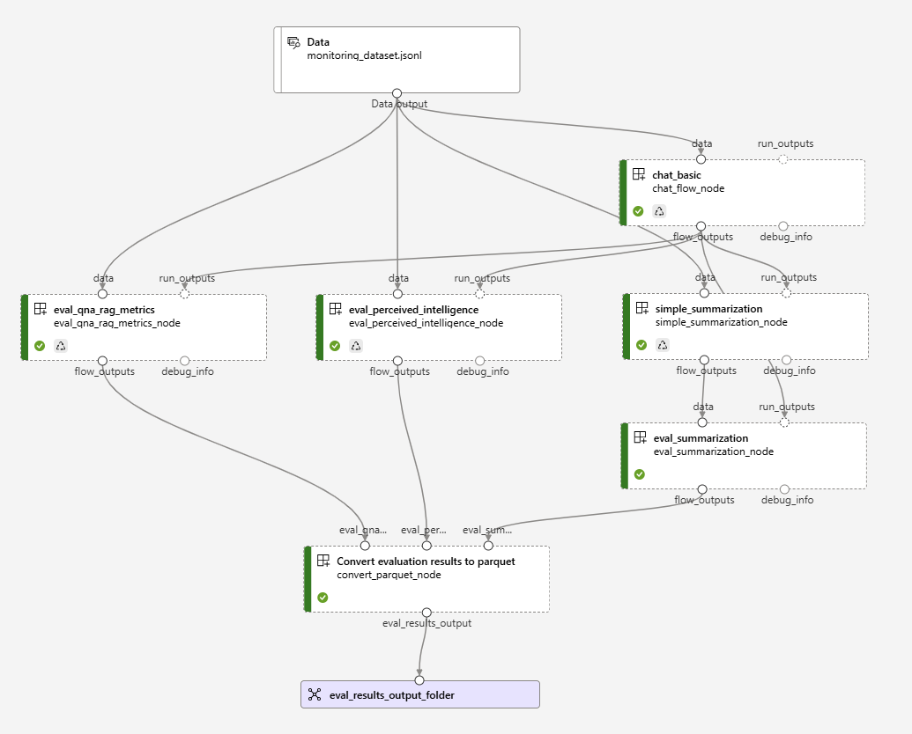
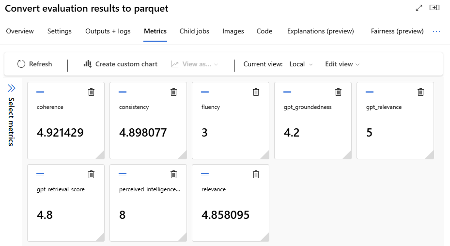
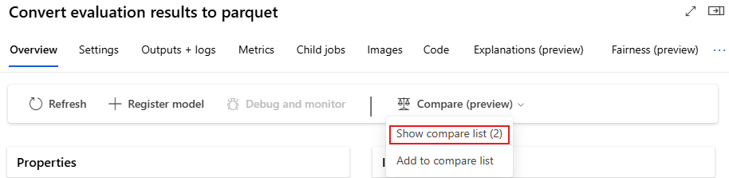
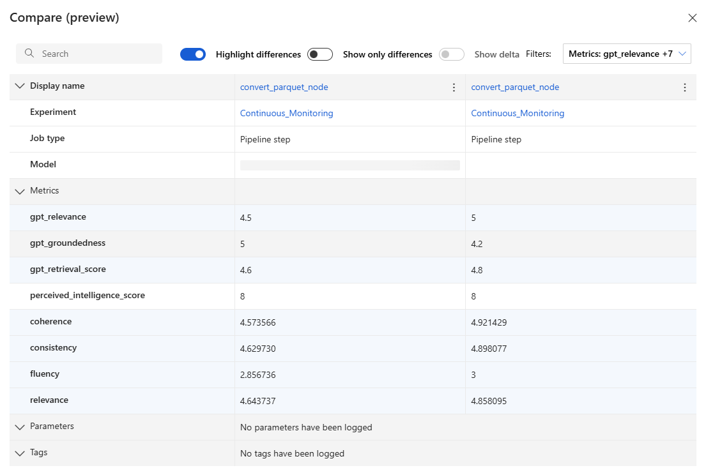

# Continuous Monitoring Pipeline

This tutorial describes an advanced use case of [running flows in Azure ML Pipelines](https://github.com/microsoft/promptflow/blob/main/examples/tutorials/run-flow-with-pipeline/pipeline.ipynb).  
The detailed explanations of the prerequisites and principles can be found in the aforementioned article.  
Continuous monitoring is necessary to maintain the quality, performance and efficiency of Generative AI applications.  
These factors directly impact the user experience and operational costs.  

We will run evaluations on a basic chatbot flow, then aggregate the results to export and visualize the metrics.  
The flows used in this pipeline are described below:
- [Basic Chat](https://github.com/microsoft/promptflow/tree/main/examples/flows/chat/chat-basic)
- [Q&A Evaluation](https://github.com/microsoft/promptflow/tree/main/examples/flows/evaluation/eval-qna-rag-metrics)
- [Perceived Intelligence Evaluation](https://github.com/microsoft/promptflow/tree/main/examples/flows/evaluation/eval-perceived-intelligence)
- [Summarization Evaluation](https://github.com/microsoft/promptflow/tree/main/examples/flows/evaluation/eval-summarization)

Connections used in this flow:
- `azure_open_ai_connection` connection (Azure OpenAI).

## Prerequisites

### Prompt flow SDK:
- Azure cloud setup:
  - An Azure account with an active subscription - [Create an account for free](https://azure.microsoft.com/free/?WT.mc_id=A261C142F)
  - Create an Azure ML resource from Azure portal - [Create a Azure ML workspace](https://ms.portal.azure.com/#view/Microsoft_Azure_Marketplace/MarketplaceOffersBlade/searchQuery/machine%20learning)
  - Connect to your workspace then setup a basic computer cluster - [Configure workspace](https://github.com/microsoft/promptflow/blob/main/examples/configuration.ipynb)
- Local environment setup:
  - A python environment
  - Installed Azure Machine Learning Python SDK v2 - [install instructions](https://github.com/microsoft/promptflow/blob/main/examples/README.md) - check the getting started section and make sure version of 'azure-ai-ml' is higher than `1.12.0`

Note: when using the Prompt flow SDK, it may be useful to also install the [`Prompt flow for VS Code`](https://marketplace.visualstudio.com/items?itemName=prompt-flow.prompt-flow) extension (if using VS Code).

### Azure AI/ML Studio:
Start a compute session.  
The follow the installation steps described in the notebook.

## Setup connections
Ensure that you have a connection to Azure OpenAI with the following deployments:
- `gpt-35-turbo`
- `gpt-4`

## Run pipeline

Run the notebook's steps until `3.2.2 Submit the job` to start the pipeline in Azure ML Studio.

## Pipeline description
The first node reads the evaluation dataset.  
The second node is the main flow that will be monitored, it takes the output of the evaluation dataset as a `data` input.  
After the main flow's node has completed, its output will go to 3 nodes:
- Q&A Evaluation
- Perceived Intelligence Evaluation
- Simple Summarization

The Simple Summarization and the main nodes' outputs will become the Summarization Evaluation node's input.

Finally, all the evaluation metrics will be aggregated and displayed in Azure ML Pipeline's interface.

## Metrics visualization
In the node `Convert evaluation results to parquet` Metrics tab, the aggregated metrics will be displayed.

The evolution of the metrics can be monitored by comparing multiple pipeline runs:  

## Contact
Please reach out to Lou Bigard (<loubigard@microsoft.com>) with any issues.