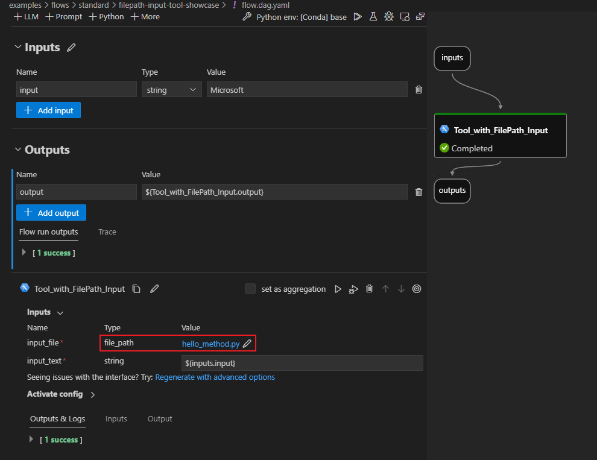

# FilePath input tool showcase

A case that shows how to use tool with FilePath as input.

## Prerequisites

1. As file path is currently in its preview phase, it is necessary for you to install the test version of the PromptFlow package:

```bash
pip install "promptflow==0.1.0b8.dev2" --extra-index-url https://azuremlsdktestpypi.azureedge.net/promptflow
```

2. Install promptflow sdk and other dependencies:

```bash
pip install -r requirements.txt
```

## Flow description

As shown in following picture, the tool `Tool_with_FilePath_Input` has a input input_file with type `file_path`, which enables users to either select an existing file or create a new one, then pass it to a tool, allowing the tool to access the file's content. Here the flow.dag.yaml selects a default `hello_method.py`.



## Run flow

- Test flow

```bash
# test with default input value in flow.dag.yaml
pf flow test --flow .

```