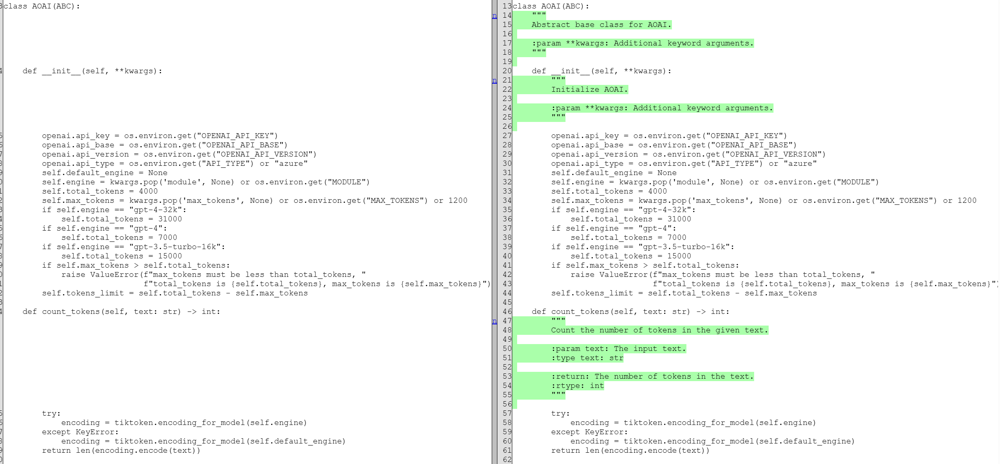

# Generate Python  docstring
This example can help you automatically generate Python code's docstring and return the modified code.

Tools used in this flow：
- `load_code` tool, it can load code from a file path.
  - Load content from a local file.
  - Loading content from a remote URL, currently loading HTML content, not just code, is under repair.
- `divide_code` tool, it can divide code into code blocks.
  - To avoid files that are too long and exceed the token limit, it is necessary to split the file.
  - Avoid using the same function (such as __init__(self)) to generate docstrings in the same one file, which may cause confusion when adding docstrings to the corresponding functions in the future.
- `generate_docstring` tool, it can generate docstring for a code block, and merge docstring into origin code.

## What you will learn

In this flow, you will learn
- How to compose an auto generate docstring flow.
- How to use different LLM APIs to request LLM, including synchronous/asynchronous APIs, chat/completion APIs.
- How to use asynchronous multiple coroutine approach to request LLM API.
- How to construct a prompt.

## Prerequisites

Install promptflow sdk and other dependencies:
```bash
pip install -r requirements.txt
```

## Execute with python command
#### Create `.env` file in this folder with below content
```
OPENAI_API_BASE=<AOAI_endpoint>
OPENAI_API_KEY=<AOAI_key>
OPENAI_API_VERSION=2023-03-15-preview
MODULE=gpt-3.5-turbo # default is gpt-3.5-turbo.  
```

#### Run the command line
`python main.py --source <your_file_path>`  
**Note**: the file path should be a python file path, default is `./azure_open_ai.py`.

A webpage will be generated, displaying diff:



## Execute with Promptflow
#### Create connection for LLM to use
```bash
# Override keys with --set to avoid yaml file changes
pf connection create --file azure_openai.yml --set api_key=<your_api_key> api_base=<your_api_base>
```

Note in [flow.dag.yaml](flow.dag.yaml) we are using connection named `azure_open_ai_connection`.
```bash
# show registered connection 
pf connection show --name azure_open_ai_connection
```

#### Start flow

```bash
# run flow with default file path in flow.dag.yaml
pf flow test --flow . 

# run flow with file path
pf flow test --flow . --inputs source="./demo_code.py"
```

```bash
# run flow with batch data
pf run create --flow . --data ./data.jsonl --name auto_generate_docstring
```
Output the code after add the docstring.


