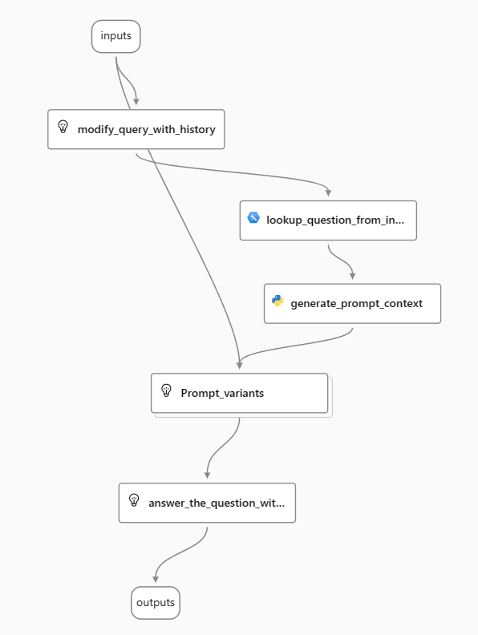
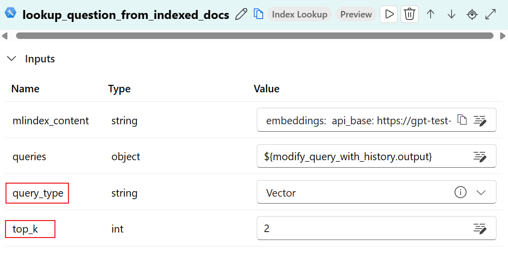
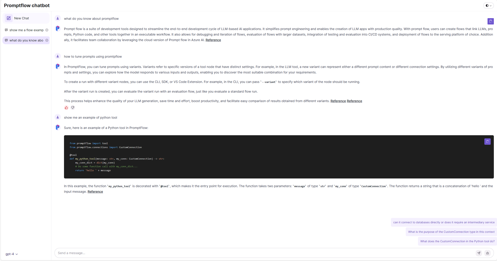

# Develop copilot with promptflow

In this tutorial, we will provide a detailed walkthrough on creating a RAG-based copilot using the Azure Machine Learning promptflow toolkit. Our tutorial will cover a range of essential topics, including:

- Initiating a RAG-based copilot flow through the AzureML Workspace Portal.
- Generating synthetic test data for the copilot.
- Evaluating the copilot's performance using test data.
- Enhancing the functionality and efficiency of your copilot flow.
- Deploying your copilot for customer use.

While we will focus on constructing a copilot for promptflow as a case study, the methodologies and steps outlined can be adapted to develop your customized copilot solutions.

## Prerequisites

- An Azure subscription. If you don't have an Azure subscription, create a free account before you begin
- An Azure Machine Learning workspace. If you don't have a workspace, create one before you begin
- Azure OpenAI connection or OpenAI connection
- Azure AI Search connection

## Step 1: Initialize a RAG based copilot flow

First, begin by cloning the promptFlow repository to your local machine. Subsequently, within your Azure Machine Learning workspace, proceed to create a vector index utilizing the document files located in the `./docs` folder. For comprehensive guidance on creating a vector index, kindly consult the documentation available at [here](https://learn.microsoft.com/en-us/azure/machine-learning/how-to-create-vector-index?view=azureml-api-2#create-a-vector-index-by-using-machine-learning-studio).

Upon successful creation of the vector index, an example flow will be automatically generated within your workspace. This example flow, which is a standard Retrieval-Augmented Generation (RAG) based copilot flow, serves as an excellent starting point for developing your own copilot. You can locate the link to this example flow on the vector index's detail page.

This is how the example flow looks like:



With some minor configuration, you can open the chat panel and directly chat with your copilot to see how good it works.


### Tips

```
Currently, the volume of test data generated cannot be directly manipulated by the user. Instead, it is contingent upon the number of segments your documents are divided into. This segmentation can be adjusted by modifying the 'document_chunk_size' and 'document_chunk_overlap' parameters in your config.yml file. Additionally, you have the option to alter the 'temperature' parameter of the LLM tool within the 'gen_test_data' example flow. By executing the 'gen_test_data' script multiple times, you can indirectly increase the quantity of test data produced.
```

## Step 2: Generate synthetic test data

To ensure the quality of the promptFlow copilot, it's imperative to conduct extensive testing using a broad dataset. Ideally, this dataset would consist of real user inquiries, such as those found on platforms like StackOverflow. However, real-world cases often fall short in both quantity and diversity. To address this gap, the creation of synthetic test data is necessary to encompass a wider array of scenarios.

Promptflow has provided comprehensive guidelines for generating synthetic test data using Large Language Models (LLMs). For step-by-step instructions, please refer to the document available at [here](../generate-test-data/README.md).

To facilitate evaluation of your copilot in Azure, consider creating a new Data Asset in your workspace specifically for this purpose.

### Tips

```
Currently, you cannot directly control how much test data you want to generate. The amount of test data is determined by how many trunks your documents are split into, you can configure that by changing the 'document_chunk_size' and 'document_chunk_overlap' parameters in your config.yml file. Meanwhile, you can also change the temperature parameter of the LLM tool in the gen_test_data example flow and run the 'gen_test_data' script for multiple times to generate more test data.
```

## Step 3: Evaluate your copilot with test data
After preparing the test data, we can utilize the evaluation flow to assess the performance of our copilot against the test data. Promptflow has developed various evaluation flows tailored for different scenarios. For our RAG-based copilot, we can leverage the evaluation flow in [this folder](../../../examples/flows/evaluation/eval-single-turn-metrics/) to ensure comprehensive and accurate performance analysis.

Clone this evaluation flow folder to your local machine or upload it to your workspace.

**Remember to update the connections used in the flow before you start evaluation.**


### Tips

```
- The evaluation process is designed to compute multiple metrics, each accompanied by comprehensive explanations in the readme file. It is imperative to understand these metrics thoroughly and select those most applicable to your project.

- The answer produced by the initial copilot flow will have a "(Source: citation)" part at the end. This is because we told the model to do that in the prompt. You can modify the default prompt to remove this part in case it affects the evaluation results as we did not append this part when generating the test data.

- Furthermore, the evaluation process will present aggregated metrics. It is essential to closely examine the results for each line, especially for the line with lower metric.
Typically, suboptimal results stem from one of two issues: either the process is underperforming, possibly due to inadequate context retrieval or prompt formulation, or the quality of the test data is insufficient.

To address the first issue, consider debugging or refining the process either locally or within the workspace. For the latter, you might either revise the problematic test cases or exclude them from your test dataset altogether.
```

## Step 4: Improve your copilot flow

After evaluation, you will find that the initial copilot flow works well and can achieve relatively good metrics. We can continue to improve the copilot in various ways.

### Improve context retrieval
The context retrieval is the most important part of RAG based approach, the quality of the retrieved context will directly affect the performance of the copilot. Take a close look at the initial copilot flow, you will find that the context retrieval is achieved by 'lookup_question_from_indexed_docs' node which is using 'Index Lookup' tool.



There are two paramters can be adjusted in the 'Index Lookup' tool: 'query_type' and 'top_k'. The initial copilot flow used 'query_type' as 'vector' and 'top_k' as 2. Try to adjust these two parameters and then run the evaluation to see which one can achieve the best metrics.

### Tune the prompt
There are two LLM nodes in the initial copilot flow: the 'modify_query_with_history' node is used for rewriting the question with the history to make it more clear; the 'answer_the_question_with_context' node is used for generating the answer based on the question and context.

You can tune the prompt of these two nodes by leveraging the variants feature of promptflow. For detailed introduction of variants, you can reference [this doc](../../../docs/how-to-guides/tune-prompts-with-variants.md).

### Add doc link to the answer
It's important to add the link of the document which is used as the context to generate the answer. This will help the user to understand where the answer comes from and also help the user to find more information if needed.

The answer generated by the initial flow will include a citation in the format "(Source: citation)." However, this citation format does not present a clickable link, making it inconvenient for end-users to directly access the source.
To address this, we propose modifications to the code within the 'generate_prompt_context' node. These adjustments aim to transform the citation into an accessible hyperlink. Furthermore, alterations to the prompt in the 'answer_the_question_with_context' node are suggested to ensure the document link is seamlessly integrated into the response. By implementing these changes, the final response will effectively incorporate the document link in a user-friendly format. The final answer will look like this:


You can find the specific code changes in the source of the promptflow copilot flow in [this folder](../../../examples/flows/chat/promptflow-copilot/).


### Avoid abuse of the copilot
Avoid abuse is a critical topic when you want to deploy your copilot to production, due to the cost consideration of LLM model. It is recommended that you add an additional authentication layer above your copilot to prevent abuse from anonymous users.

But what if we cannot add the authentication layer or we want to save the login effort for the users ? How do we avoid the abuse of the copilot in this case?

One common approach is to refine the prompts used in the 'answer_the_question_with_context' function to instruct the model to only respond if the answer can be sourced from the provided context. Despite this, test results indicate that the model may still respond to queries unrelated to the context, particularly with general inquiries such as "What is the capital of China?" or when chat histories extend over multiple interactions.

A more effective strategy involves integrating an additional LLM node tasked with evaluating the relevance of a query to the copilot's capabilities (in this scenario, referred to as 'promptflow'). This node assigns a relevance score to each query. Queries with a relevance score below a predetermined threshold would bypass the context retrieval phase, and the system would instead inform the user that their question is not pertinent to the copilot's functionality. Users would be encouraged to rephrase their queries for better alignment with the copilot's capabilities.

You can find the specific code changes in the source of the promptflow copilot flow in [this folder](../../../examples/flows/chat/promptflow-copilot/).


## Step 5: Bring your copilot to customers

The final step is to bring our intelligent copilot to customers. Obviously, we cannot ask customers to run the flow directly from their side, so we must firstly deploy the flow. Promptflow has provided plenty of ways to deploy the flow, you can find the details [here](../../../docs/how-to-guides/deploy-a-flow/). The best way to do it depends on the specific scenario of your copilot.

We want our customers to access promptflow copilot through a web page with chat UI experience, so we will deploy the flow as a managed online endpoint. You can find the detailed instructions [here](https://learn.microsoft.com/en-us/azure/machine-learning/prompt-flow/how-to-deploy-for-real-time-inference?view=azureml-api-2).

### Host web app with Azure App Service
Currently, the managed online endpoint does not support Cross-Origin Resource Sharing (CORS), preventing direct access from a webpage. To facilitate interaction with the endpoint, it is necessary to host a web application. Azure App Service offers a comprehensive solution for this requirement, providing a fully managed platform designed for building, deploying, and scaling web applications. By utilizing Azure App Service, you can host your web application efficiently and establish interaction with the promptflow copilot endpoint.

### Chat UI experience
The chat interface significantly impacts the overall user experience with the copilot, directly influencing how users interact with the system. While constructing a ChatGPT-style interface from the ground up is feasible, utilizing established open-source projects can greatly streamline and expedite the process. One of the projects we have tried is `chatgpt-lite`, we had built our promptflow copilot's UI based on it. You can find the source code of the chat UI [here](https://github.com/melionel/chatgpt-lite/tree/talk_to_endpoint_appservice).



### Provide suggested follow-up questions

Incorporating follow-up question suggestions is an effective strategy to enhance user experience and communication efficiency. One approach is to instruct the model to include follow-up questions in its responses. However, this method may not always be reliable and could complicate response processing. An alternative strategy involves utilizing a separate flow dedicated to generating follow-up question suggestions. For this purpose, you can employ the 'question_simulation' flow found in [this folder](../../../examples/flows/standard/question-simulation/).

Deploying the `question_simulation` flow as a managed online endpoint and integrating it into your web application allows for dynamic generation of pertinent follow-up questions based on previous chat interactions.

### Collect user feedback

User feedback is invaluable for enhancing the copilot's performance and user experience. By incorporating a feedback mechanism into the chat interface, users can provide real-time feedback on the copilot's responses. This feedback can be used to refine the copilot's performance and prompt formulation, ensuring continuous improvement.

When you deploy the flow as a managed online endpoint, you will find the endpoint has provided two POST APIs if you check the endpoint's swagger: `/score` for trigger your copilot flow with inputs and `/feedback` for collecting user feedback into the trace data.

```
- You are recommended to turn on this options when you deploy the MIR endpoint, so that you can collect the related data and calculate online metrics to your workspace's application insights.
```

