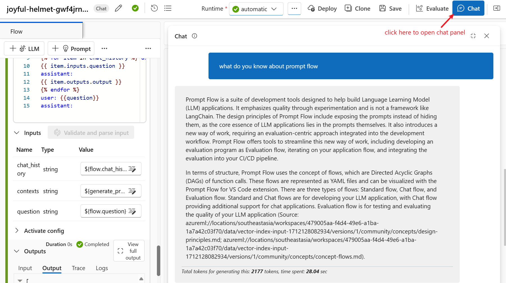
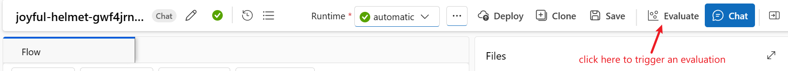
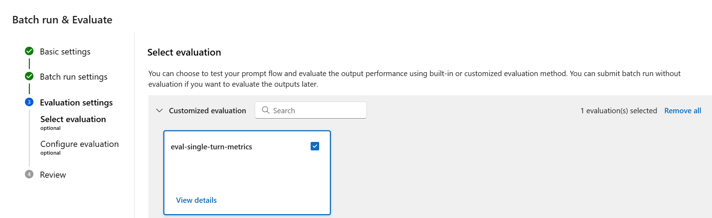
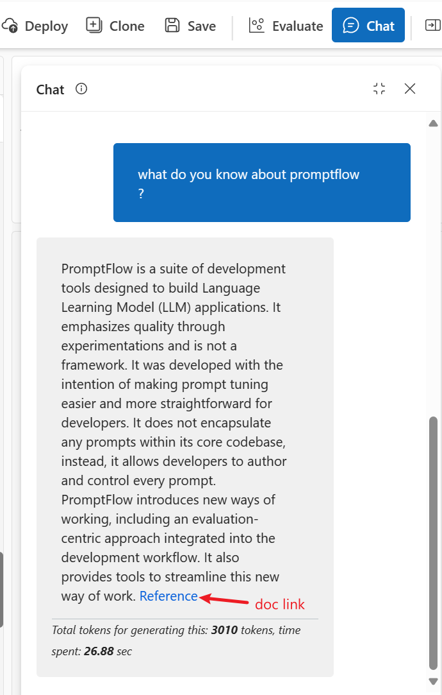
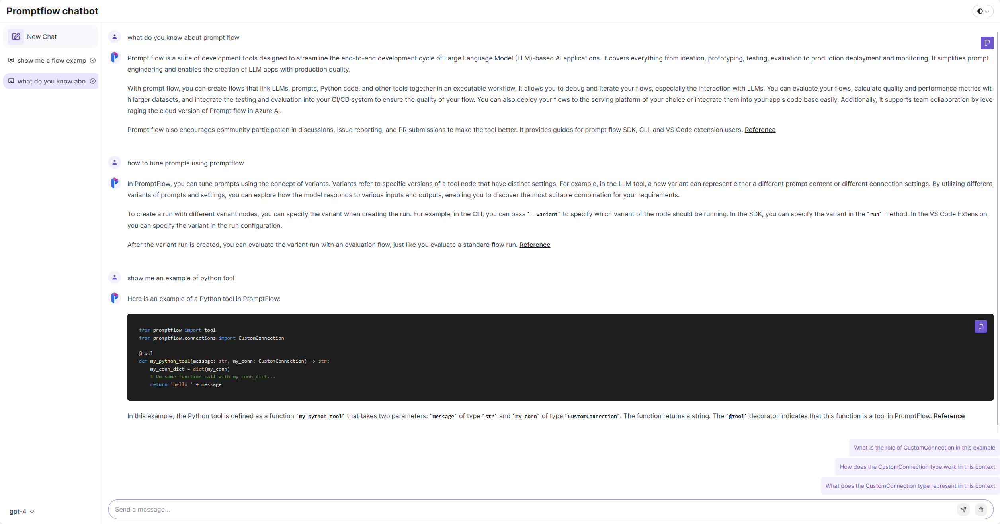

# Develop promptflow copilot

In this tutorial, we will show you how to develop a RAG based copilot step by step using the toolsets provided by Azure Machine Learning promptflow. Specifically, we will cover the following topics:
- How to initialize a RAG based copilot flow from AzureML workspace portal
- How to generate synthetic test data for the copilot
- How to evaluate your copilot with test data
- How to improve your copilot flow
- How to bring your copilot to customers

We will develop copilot for promptflow as example in this tutorial, you can develop your own copilot following the similar steps.

## Prerequisites

- An Azure subscription. If you don't have an Azure subscription, create a free account before you begin
- An Azure Machine Learning workspace. If you don't have a workspace, create one before you begin
- Azure OpenAI connection or OpenAI connection
- Azure AI Search connection

## Step 1: Initialize a RAG based copilot flow

Firstly, clone the promptflow repository to your local machine. Then, in your Azure Machine Learning workspace, create vector index using the document files inside `./docs` folder. For detailed instructions about create vector index, you can reference the document [here](https://learn.microsoft.com/en-us/azure/machine-learning/how-to-create-vector-index?view=azureml-api-2#create-a-vector-index-by-using-machine-learning-studio).

After the vector index created, an example prompt flow will be automatically generated in the workspace. You can find the example prompt flow's link in the vector index's detail page. The example flow is a typical RAG based copilot flow, it will be a good start point for use to develop our copilot.

This is how the example flow looks like:


With some minor configuration, you can open the chat panel and directly chat with your copilot to see how good it works.



### Tips

```
Prepare your data carefully. The quality of the data will directly affect the performance of the copilot. Promptflow had prepared rich and insightful document in the `./docs` folder, so we vectorized it as the context for our copilot. Meanwhile, we filter out the image files which cannot be vectorized and some markdown files that contains no meaningful information.
```

## Step 2: Generate synthetic test data

To ensure the quality of the promptflow copilot, we need to test it on a large set of data. The test data could be from the real user cases, like questions posted on stackoverflow. However, the test data from real user cases is usually lack of amount and comprehensiveness. Therefore, we need to generate synthetic test data to cover more scenarios.

Promptflow had prepared detailed guidelines on how to generate synthetic test data for your documents by leveraging the capabilities of LLM. For detailed steps, you can reference [this doc](../../../docs/how-to-guides/generate-test-data.md).

Create a new Data asset in your workspace if your want to evaluate your copilot with the test data in azure.

### Tips

```
Currently, you cannot directly control how much test data you want to generate. The amount of test data is determined by how many trunks your documents are split into, you can configure that by changing the 'document_chunk_size' and 'document_chunk_overlap' parameters in your config.yml file. Meanwhile, you can also change the temperature parameter of the LLM tool in the gen_test_data example flow and run the 'gen_test_data' script for multiple times to generate more test data.
```

## Step 3: Evaluate your copilot with test data
After we prepared the test data, we can use evaluation flow to evaluate the performance of our copilot againt the test data. Promptflow had prepared various of evaluation flows for different scenarios. For our RAG based copilot, we can leverage the evaluation flow in [this folder](../../../examples/flows/evaluation/eval-single-turn-metrics/).

Clone this evaluation flow folder to your local machine or upload it to your workspace.

**Remember to update the connections used in the flow before you start evaluation.**



### Tips

```
- The evaluation flow supports calculating multiple metrics, and have detailed explanations for each metric in the readme file. Make sure you understand each of them and choose the metrics that are most relevant to your copilot.

- The answer produced by the initial copilot flow will have a "(Source: citation)" part at the end. This is because we told the model to do that in the prompt. You can modify the default prompt to remove this part in case it affects the evaluation results as we did not append this part when generating the test data.

- The evaluation flow will give you aggregated metrics. It's important to zoom into the metrics result for each line, especially for the line with lower score.

The bad cases usually caused by two reasons: one is the flow is not performing well, whether because the context retrival or prompt; the other is the test data is not good enough.

For the first case, you can try to debug or tune the flow in local or in the workspace.
For the second case, you can try to modify the test case or abandon it from your test dataset.
```

## Step 4: Improve your copilot flow

After evaluation, you will find that the initial copilot flow works well and can achieve relatively good metrics. We can continue improve the copilot in various ways.

### Improve context retrieval
The context retrieval is the most important part of RAG based approach, the quality of the retrieved context will directly affect the performance of the copilot. Take a close look at the initial copilot flow, you will find that the context retrieval is achieved by 'lookup_question_from_indexed_docs' node which is using 'Index Lookup' tool.


There are two paramters can be adjusted in the 'Index Lookup' tool: 'query_type' and 'top_k'. The initial copilot flow used 'query_type' as 'vector' and 'top_k' as 2. Try to adjust these two parameters and then run the evaluation to see which one can achieve the best metrics.

### Tune the prompt
There are two LLM nodes in the initial copilot flow: the 'modify_query_with_history' node is used for rewriting the question with the history to make it more clear; the 'answer_the_question_with_context' node is used for generating the answer based on the question and context.

You can tune the prompt of these two nodes by leveraging the variants feature of promptflow. For detailed introduction of variants, you can reference [this doc](../../../docs/how-to-guides/tune-prompts-with-variants.md).

### Add doc link to the answer
It's important to add the link of the document which is used as the context to generate the answer. This will help the user to understand where the answer comes from and also help the user to find more information if needed.

The answer produced by the initial copilot flow will have a "(Source: citation)" part at the end. But the citation is not reachable link for end user, and the source:citation format is not suitable to be shown as a hyperlink.

To append the doc link gracefully to the answer, we can slightly modify the code of the 'generate_prompt_context' node to make the citation a reachable hyperlink. And modify the prompt of the 'answer_the_question_with_context' node to make the answer include the doc link with a proper format. The final answer will look like this:



You can find the specific code changes in the source of the promptflow copilot flow in [this folder](../../../examples/flows/chat/promptflow-copilot/).


### Avoid abuse of the copilot
Avoid abuse is a critical topic when you want to deploy your copilot to production, due to the cost consideration of LLM model. It is recommended that you add an additional authentication layer above your copilot to prevent abuse from anonymous users.

But what if we cannot add the authentication layer or we want to save the login effort for the users ? How do we avoid the abuse of the copilot in this case?

A common way is to adjust the prompt used in the 'answer_the_question_with_context' node to tell the model only answer the question if the answer can be found from the retrived context. But the testing result shows that even if we do so, the model will still answer the questions which are irrelevant to the context, especially when the question is a general question like "what is the capital of China ?" or chat history becomes longer.

A better way could be adding an extra LLM node to determine the relevance of the question to the copilot (in our case, the promptflow) and give a score to the relevance. Then we check the score, if the relevance score is lower than a threshold, we will skip the context retrieval step and directly return a message to the users to tell them that the question is not relevant to the copilot and suggest them to rephrase the question.

You can find the specific code changes in the source of the promptflow copilot flow in [this folder](../../../examples/flows/chat/promptflow-copilot/).


## Step 5: Bring your copilot to customers

The final step is to bring our intelligent copilot to customers. Obviously, we cannot ask customers to run the flow directly from their side, so we must firstly deploy the flow. Promptflow has provided plenty of ways to deploy the flow, you can find the details [here](../../../docs/how-to-guides/deploy-a-flow/). The best way to do it depends on the specific scenario of your copilot.

We want our customers to access promptflow copilot through a web page with chat UI experience, so we will deploy the flow as a managed online endpoint. You can find the detailed instructions [here](https://learn.microsoft.com/en-us/azure/machine-learning/prompt-flow/how-to-deploy-for-real-time-inference?view=azureml-api-2).

### Host web app with Azure App Service
Currently, managed online endpoint does not support CORS, so we cannot directly access the endpoint from a web page. We need to host a web app to interact with the endpoint. Azure App Service is a fully managed platform for building, deploying, and scaling web apps. You can use Azure App Service to host your web app and interact with the promptflow copilot endpoint.

### Chat UI experience
The chat UI experience is also a critical part of the copilot, it will directly affect the user's experience. It's not complicated to implement a ChatGPT like UI from scratch, but it will be much easier and faster to leverage the wonderful open source projects. One of the projects we have tried is `chatgpt-lite`, we had built our promptflow copilot's UI based on it. You can find the source code of the chat UI [here](https://github.com/melionel/chatgpt-lite/tree/talk_to_endpoint_appservice).



### Provide suggested follow-up questions

Provide suggested follow-up questions is a good way to improve the user experience and communication efficiency.
A simple solution is to directly tell the model to return the follow-up questions along with the answer in the response, however this is not realiable and increase the complexity of processing the response. Another solution is to use another flow to do the follow-up question generation task. You can leverage the 'question_simulation' flow in [this folder](../../../examples/flows/standard/question-simulation/) to generate the suggestions for the next question based on the previous chat history.

Deploy the `question_simulation` flow as a managed online endpoint and call it in your web app to get the follow-up questions.

### Tips
```
- You are recommended to turn on these two options when you deploy the MIR endpoint, so that you can collect the related data and calculate online metrics.
```

