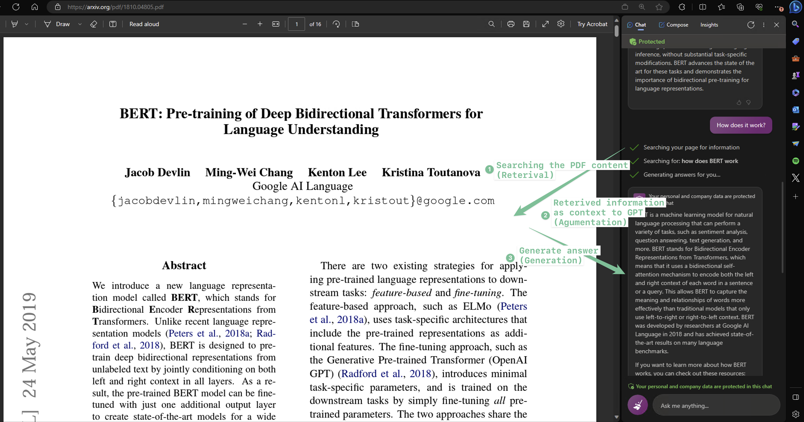
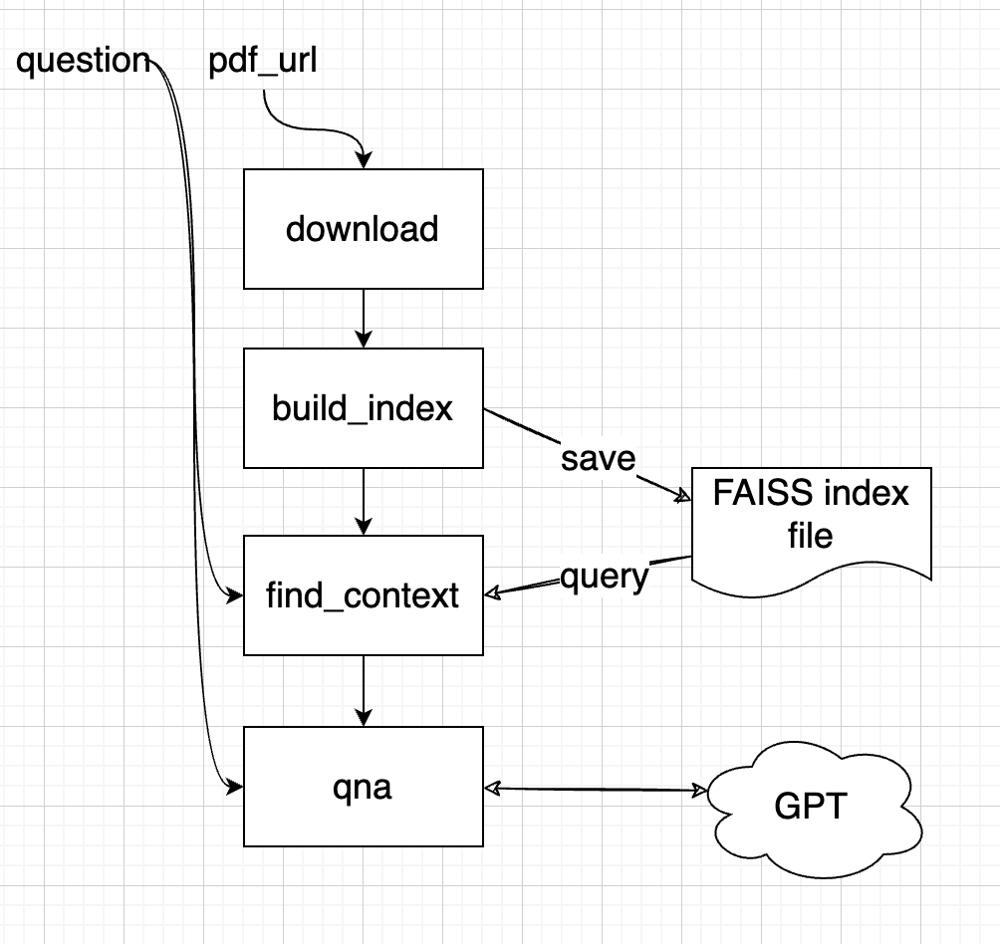
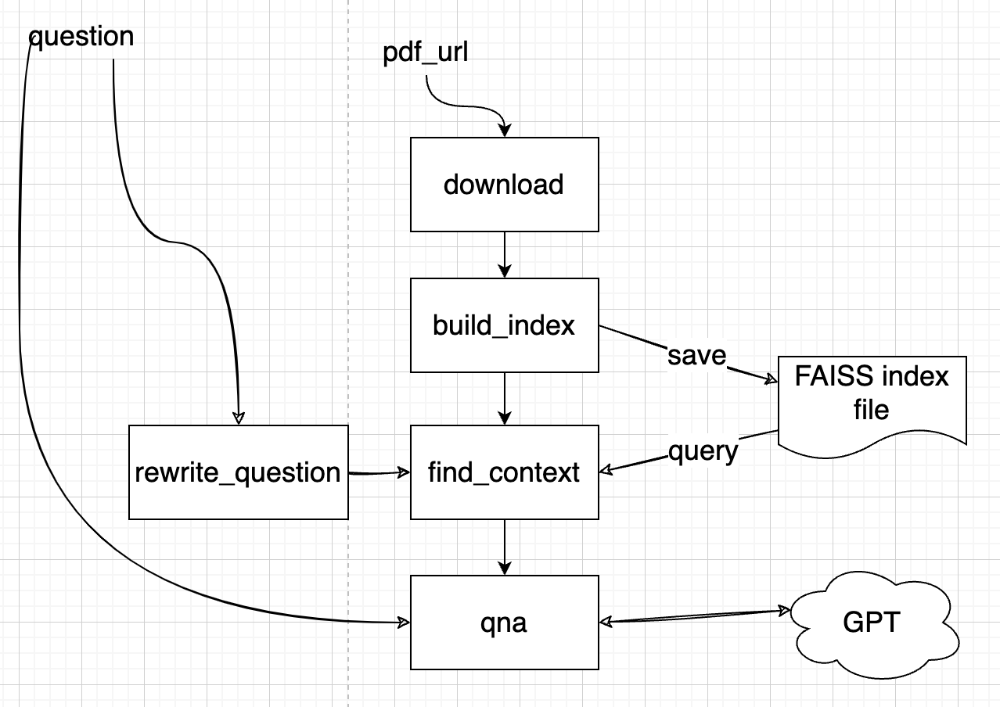
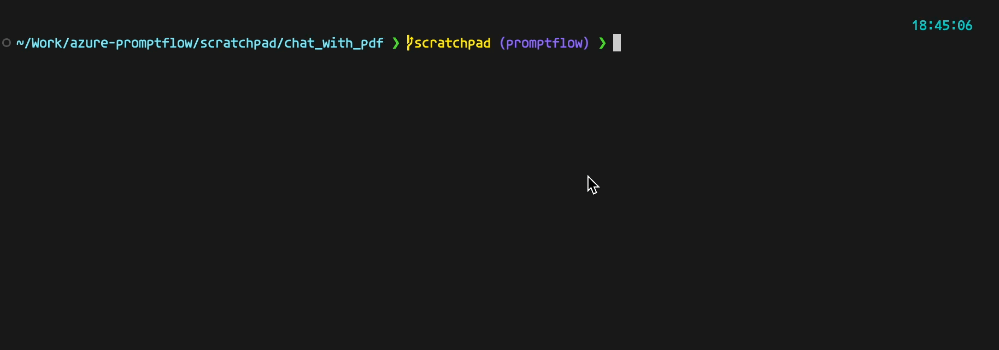
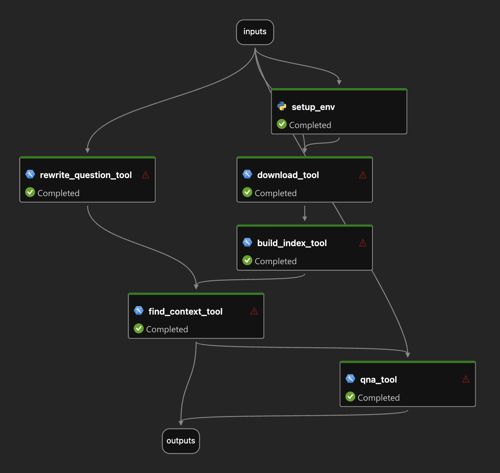
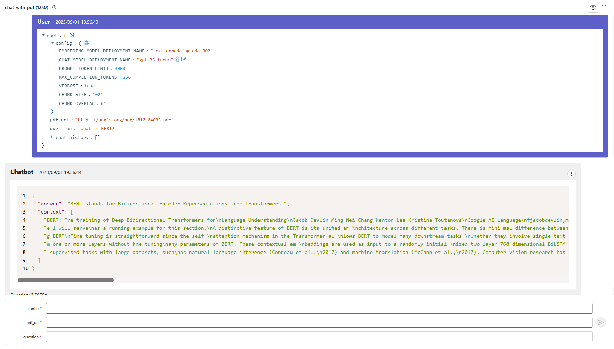
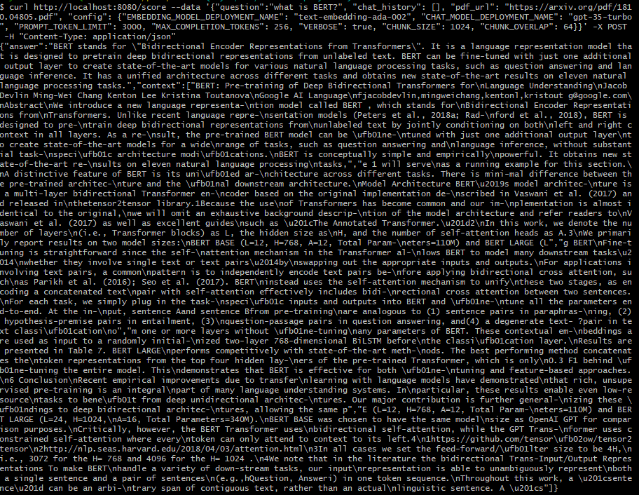

# Tutorial: Chat with PDF

## Overview
Retrieval Augmented Generation (or RAG) has become a prevalent pattern to build intelligent application with Large Language Models (or LLMs) since it can infuse external knowledge into the model, which is not trained with those up-to-date or proprietary information. The screenshot below shows how new Bing in Edge sidebar can answer questions based on the page content on the left - in this case, a PDF file.

Note that new Bing will also search web for more information to generate the answer, let's ignore that part for now.

In this tutorial we will try to mimic the functionality of retrieval of relevant information from the PDF to generate an answer with GPT. 

**We will guide you through the following steps:**

Creating a console chatbot "chat_with_pdf" that takes a URL to a PDF file as an argument and answers questions based on the PDF's content.
Constructing a prompt flow for the chatbot, primarily reusing the code from the first step.
Creating a dataset with multiple questions to swiftly test the flow.
Evaluating the quality of the answers generated by the chat_with_pdf flow.
Incorporating these tests and evaluations into your development cycle, including unit tests and CI/CD.
Deploying the flow to Azure App Service and Streamlit to handle real user traffic.

## Prerequisite
To go through this tutorial you should:
1. Install dependencies
```bash
   cd ../../flows/chat/chat-with-pdf/
   pip install -r requirements.txt
```

2. Install and configure [Prompt flow for VS Code extension](https://marketplace.visualstudio.com/items?itemName=prompt-flow.prompt-flow) follow [Quick Start Guide](https://microsoft.github.io/promptflow/how-to-guides/quick-start.html). (_This extension is optional but highly recommended for flow development and debugging._)


## Console chatbot chat_with_pdf
A typical RAG application has two steps:
- **Retrieval**: Retrieve context information from external systems (database, search engine, files, etc.)
- **Generation**: Construct the prompt with the retrieved context and get response from LLMs.

The retrieval step, being more of a search problem, can be quite complex. A widely used, simple yet effective approach is vector search, which requires an index building process. Suppose you have one or more documents containing the contextual information, the index building process would look something like this:
1. **Chunk**: Break down the documents into multiple chunks of text.
2. **Embedding**: Each text chunk is then processed by an embedding model to convert it into an array of floating-point numbers, also known as embedding or vector.
3. **Indexing**: These vectors are then stored in an index or a database that supports vector search. This allows for the retrieval of the top K relevant or similar vectors from the index or database.

Once the index is built, the **Retrieval** step simply involves converting the quesion into embedding/vector and perform a vector search on the index to obtain the most relevant context for the question.

OK now back to the chatbot we want to build, a simplified design could be:



A more robust or practical application might consider using an external vector database to store the vectors. For this simple example we've opted to use [FAISS](https://github.com/facebookresearch/faiss) index, which can be saved as a file. To prevent repetitive downloading and index building for same PDF file, we will add a check that if the PDF file already exists then we won't download, same for index building.

This design is quite effective for question and answering, but it may fall short when it comes to multi-turn conversations with the chatbot. Consider a scenario like this:

> $User: what is BERT?
>
> $Bot: BERT stands for Bidirectional Encoder Representations from Transformers. 
>
> $User: is it better than GPT?
>
> $Bot: ...

You would typically expect the chatbot to be intelligent enough to decipher that the "it" in your second question refers to BERT, and your actual question is "is BERT better than GPT". However, if you present the question "is it better than GPT" to the embedding model and then to the vector index/database, they won't recognize that "it" represents BERT. Consequently, you won't receive the most relevant context from the index. To address this issue, we will enlist the assistance of a Large Language Model (LLM), such as GPT, to "rewrite" the question based on the previous question. The updated design is as follows:



A "rewrite_question" step is performed before feeding the question to "find_context" step.

### Take a look at the chatbot in action!
You should be able to run the console app by:
```shell
python chat_with_pdf/main.py https://arxiv.org/pdf/1810.04805.pdf
```
> Note: https://arxiv.org/pdf/1810.04805.pdf is the paper about one of the most famous earlier LLMs: BERT.

It looks like below if everything goes fine:


Now, let's delve into the actual code that implements the chatbot.

### Configurations
Despite being a minimalistic LLM application, there are several aspects we may want to adjust or experiment with in the future. We'll store these in environment variables for ease of access and modification. In the subsequent sections, we'll guide you on how to experiment with these configurations to enhance your chat application's quality.

Create a .env file in this directory and populate it with the following content. We can use the load_dotenv() function to import these into our environment variables later on. We'll delve into what these variables represent when discussing how each step of the process is implemented.

Check out [example env file](.env.example).
```ini
OPENAI_API_TYPE=azure
OPENAI_API_BASE=<AOAI_endpoint>
OPENAI_API_KEY=<AOAI_key>
OPENAI_API_VERSION=2023-05-15
EMBEDDING_MODEL_DEPLOYMENT_NAME=text-embedding-ada-002
CHAT_MODEL_DEPLOYMENT_NAME=gpt-35-turbo
PROMPT_TOKEN_LIMIT=3000
MAX_COMPLETION_TOKENS=256
CHUNK_SIZE=1024
CHUNK_OVERLAP=64
VERBOSE=False
```
Note: CHAT_MODEL_DEPLOYMENT_NAME should point to a chat model like gpt-3.5-turbo or gpt-4

### Implementation of each steps
#### Download pdf: [download.py](../../flows/chat/chat-with-pdf/chat_with_pdf/download.py)
The downloaded PDF file will be stored into a temp folder.

#### Build index: [build_index.py](../../flows/chat/chat-with-pdf/chat_with_pdf/build_index.py)
Several libraries are used in this step to build index:
1. PyPDF2 for extraction of text from the PDF file.
2. OpenAI python library for generating embeddings.
3. The FAISS library is utilized to build a vector index and save it to a file. It's important to note that an additional dictionary is used to maintain the mapping from the vector index to the actual text snippet. This is because when we later attempt to query for the most relevant context, we need to locate the text snippets, not just the embedding or vector.
The environment variables used in this step:
- OPENAI_API_* and EMBEDDING_MODEL_DEPLOYMENT_NAME: to access the Azure OpenAI embedding model
- CHUNK_SIZE and CHUNK_OVERLAP: controls how to split the PDF file into chunks for embedding
   
#### Rewrite question: [rewrite_question.py](../../flows/chat/chat-with-pdf/chat_with_pdf/rewrite_question.py)
This step is to use ChatGPT/GPT4 to rewrite the question to be better fit for finding relevant context from the vector index. The prompt file [rewrite_question.md](../../flows/chat/chat-with-pdf/chat_with_pdf/rewrite_question_prompt.md) should give you a better idea how it works. 

#### Find context: [find_context.py](../../flows/chat/chat-with-pdf/chat_with_pdf/find_context.py)
In this step we load the FAISS index and the dict that were built in the "build index" step. We then turn the question into a vector using the same embedding function in the build index step. There is a small trick in this step to make sure the context will not exceed the token limit of model input prompt ([aoai model max request tokens](https://learn.microsoft.com/en-us/azure/ai-services/openai/concepts/models), OpenAI has similar limit). The output of this step is the final prompt that QnA step will send to the chat model. The PROMPT_TOKEN_LIMIT environment variable decides how big the context is.

#### QnA: [qna.py](../../flows/chat/chat-with-pdf/chat_with_pdf/qna.py)
Use OpenAI's ChatGPT or GPT4 model and ChatCompletion API to get an answer with the previous conversation history and context from PDF.

#### The main loop: [main.py](../../flows/chat/chat-with-pdf/chat_with_pdf/main.py)
This is the main entry of the chatbot, which includes a loop that reads questions from user input and subsequently calls the steps mentioned above to provide an answer.

To simplify this example, we store the downloaded file and the constructed index as local files. Although there is a mechanism in place to utilize cached files/indices, loading the index still takes a certain amount of time and contributes to a latency that users may notice. Moreover, if the chatbot is hosted on a server, it requires requests for the same PDF file to hit the same server node in order to effectively use the cache. In a real-world scenario, it's likely preferable to store the index in a centralized service or database. There're many such database available, such as [Azure Cognitive Search](https://learn.microsoft.com/en-us/azure/search/vector-search-overview), [Pinecone](https://www.pinecone.io/), [Qdrant](https://qdrant.tech/), ...

## Prompt flow: when you start considering the quality of your LLM app
Having a functioning chatbot is a great start, but it's only the beginning of the journey. Much like any application based on machine learning, the development of a high-quality LLM app usually involves a substantial amount of tuning. This could include experimenting with different prompts such as rewriting questions or QnAs, adjusting various parameters like chunk size, overlap size, or context limit, or even redesigning the workflow (for instance, deciding whether to include the rewrite_question step in our example).

Appropriate tooling is essential for facilitating this experimentation and fine-tuning process with LLM apps. This is where the concept of prompt flow comes into play. It enables you to test your LLM apps by:

- Running a few examples and manually verifying the results.
- Running larger scale tests with a formal approach (using metrics) to assess your app's quality.

You may have already learned how to create a prompt flow from scratch. Building a prompt flow from existing code is also straightforward. You can construct a chat flow either by composing the YAML file or using the visual editor of [Visual Studio Code extension](https://marketplace.visualstudio.com/items?itemName=prompt-flow.prompt-flow) and create a few wrappers for existing code. 

Check out below:
- [flow.dag.yaml](../../flows/chat/chat-with-pdf/flow.dag.yaml)
- [setup_env.py](../../flows/chat/chat-with-pdf/setup_env.py)
- [download_tool.py](../../flows/chat/chat-with-pdf/download_tool.py)
- [build_index_tool.py](../../flows/chat/chat-with-pdf/build_index_tool.py)
- [rewrite_question_tool.py](../../flows/chat/chat-with-pdf/rewrite_question_tool.py)
- [find_context_tool.py](../../flows/chat/chat-with-pdf/find_context_tool.py)
- [qna_tool.py](../../flows/chat/chat-with-pdf/qna_tool.py)

E.g. build_index_tool wrapper:
```python
from promptflow import tool
from chat_with_pdf.build_index import create_faiss_index


@tool
def build_index_tool(pdf_path: str) -> str:
    return create_faiss_index(pdf_path)
```

The setup_env node requires some explanation: you might recall that we use environment variables to manage different configurations, including OpenAI API key in the console chatbot, in prompt flow we use [Connection](https://microsoft.github.io/promptflow/concepts/concept-connections.html) to manage access to external services like OpenAI and support passing configuration object into flow so that you can do experimentation easier. The setup_env node is to write the properties from connection and configuration object into environment variables. This allows the core code of the chatbot remain unchanged.

We're using Azure OpenAI in this example, below is the shell command to do so:
```bash
# create connection needed by flow
if pf connection list | grep open_ai_connection; then
    echo "open_ai_connection already exists"
else
    pf connection create --file ../../../connections/azure_openai.yml --name open_ai_connection --set api_key=<your_api_key> api_base=<your_api_base>
fi
```

If you plan to use OpenAI instead you can use below instead:
```shell
# create connection needed by flow
if pf connection list | grep open_ai_connection; then
    echo "open_ai_connection already exists"
else
    pf connection create --file ../../../connections/openai.yml --name open_ai_connection --set api_key=<your_api_key>
fi
```

The flow looks like:



## Prompt flow evaluations
Now the prompt flow for chat_with_pdf is created, you might have already run/debug flow through the Visual Studio Code extension. It's time to do some testing and evaluation, which starts with:
1. Create a test dataset which contains a few question and pdf_url pairs.
2. Use existing [evaluation flows](https://github.com/microsoft/promptflow/tree/main/examples/flows/evaluation) or develop new evaluation flows to generate metrics.

A small dataset can be found here: [bert-paper-qna.jsonl](../../flows/chat/chat-with-pdf/data/bert-paper-qna.jsonl) which contains around 10 questions for the BERT paper.

You can do a batch run with the test dataset and manual review the output. This can be done through the Visual Studio Code extension, or CLI or Python SDK.

**batch_run.yaml**
```yaml
name: chat_with_pdf_default_20230820_162219_559000
flow: .
data: ./data/bert-paper-qna.jsonl
#run: <Uncomment to select a run input>
column_mapping:
  chat_history: ${data.chat_history}
  pdf_url: ${data.pdf_url}
  question: ${data.question}
  config: 
    EMBEDDING_MODEL_DEPLOYMENT_NAME: text-embedding-ada-002
    CHAT_MODEL_DEPLOYMENT_NAME: gpt-35-turbo
    PROMPT_TOKEN_LIMIT: 3000
    MAX_COMPLETION_TOKENS: 256
    VERBOSE: true
    CHUNK_SIZE: 1024
    CHUNK_OVERLAP: 64
```
**CLI**
```bash
run_name="chat_with_pdf_"$(openssl rand -hex 12)
pf run create --file batch_run.yaml --stream --name $run_name
```

The output will include something like below:
```json
{
    "name": "chat_with_pdf_default_20230820_162219_559000",
    "created_on": "2023-08-20T16:23:39.608101",
    "status": "Completed",
    "display_name": "chat_with_pdf_default_20230820_162219_559000",
    "description": null,
    "tags": null,
    "properties": {
        "flow_path": "/Users/jietong/Work/azure-promptflow/scratchpad/chat_with_pdf",
        "output_path": "/Users/jietong/.promptflow/.runs/chat_with_pdf_default_20230820_162219_559000"
    },
    "flow_name": "chat_with_pdf",
    "data": "/Users/jietong/Work/azure-promptflow/scratchpad/chat_with_pdf/data/bert-paper-qna.jsonl",
    "output": "/Users/jietong/.promptflow/.runs/chat_with_pdf_default_20230820_162219_559000/    flow_outputs/output.jsonl"
}
```

And we developed two evaluation flows one for "[groundedness](../../flows/evaluation/eval-groundedness/)" and one for "[perceived intelligence](../../flows/evaluation/eval-perceived-intelligence/)". These two flows are using GPT models (ChatGPT or GPT4) to "grade" the answers. Reading the prompts will give you better idea what are these two metrics:
- [groundedness prompt](../../flows/evaluation/eval-groundedness/gpt_groundedness.md)
- [perceived intelligence prompt](../../flows/evaluation/eval-perceived-intelligence/gpt_perceived_intelligence.md)

Conceptually evaluation is also a batch run - batch run of evaluation flow with the previous run as input.

**eval_run.yaml:**
```yaml
flow: ../../evaluation/eval-groundedness
run: chat_with_pdf_default_20230820_162219_559000
column_mapping:
  question: ${run.inputs.question}
  answer: ${run.outputs.answer}
  context: ${run.outputs.context}
```
NOTE: the run property in eval_run.yaml is the run name of batch_run.yaml

**CLI:**
```bash
eval_run_name="eval_groundedness_"$(openssl rand -hex 12)
pf run create --file eval_run.yaml --run $run_name --name $eval_run_name
```

After the run completes you can use below commands to get detail of the runs:
```bash
pf run show-details --name $eval_run_name
pf run show-metrics --name $eval_run_name
pf run visualize --name $eval_run_name
```

## Experimentation!!
We have now explored how to conduct tests and evaluations for prompt flow. Additionally, we have defined two metrics to gauge the performance of our chat_with_pdf flow. By trying out various settings and configurations, running evaluations, and then comparing the metrics, we can determine the optimal configuration for production deployment.

There are several aspects we can experiment with, including but not limited to:

Varying prompts for the rewrite_question and/or QnA steps.
Adjusting the chunk size or chunk overlap during index building.
Modifying the context limit.
These elements can be managed through the "config" object in the flow inputs. If you wish to experiment with the first point (varying prompts), you can add properties to the config object to control this behavior - simply by directing it to different prompt files.

Take a look at how we experiment with #3 in below test: [test_eval in tests/chat_with_pdf_test.py](../../flows/chat/chat-with-pdf/tests/azure_chat_with_pdf_test.py). This test will create 6 runs in total:

1. chat_with_pdf_2k_context
2. chat_with_pdf_3k_context
3. eval_groundedness_chat_with_pdf_2k_context
4. eval_perceived_intelligence_chat_with_pdf_2k_context
5. eval_groundedness_chat_with_pdf_3k_context
6. eval_perceived_intelligence_chat_with_pdf_3k_context

As you can probably tell through the names: run #3 and #4 generate metrics for run #1, run #5 and #6 generate metrics for run #2. You can compare these metrics to decide which performs better - 2K context or 3K context.

NOTE: [azure_chat_with_pdf_test](../../flows/chat/chat-with-pdf/tests/azure_chat_with_pdf_test.py) does the same tests but using Azure AI as backend, so you can see all the runs in a nice web portal with all the logs and metrics comparison etc. 


Further reading:
- Learn [how to experiment with the chat-with-pdf flow](../../flows/chat/chat-with-pdf/chat-with-pdf.ipynb)
- Learn [how to experiment with the chat-with-pdf flow on Azure](../../flows/chat/chat-with-pdf/chat-with-pdf-azure.ipynb) so that you can collaborate with your team.

## Integrate prompt flow into your CI/CD workflow
It's also straightforward to integrate these into your CI/CD workflow using either CLI or SDK. In this example we have various unit tests to run tests/evaluations for chat_with_pdf flow.

Check the [test](../../flows/chat/chat-with-pdf/tests/) folder.

```bash
# run all the tests
python -m unittest discover -s tests -p '*_test.py'
```

## Deployment
The flow can be deployed across multiple platforms, such as a local development service, within a Docker container, onto a Kubernetes cluster, etc.

The following sections will guide you through the process of deploying the flow to a Docker container, for more details about
the other choices, please refer to [flow deploy docs](https://microsoft.github.io/promptflow/how-to-guides/deploy-a-flow/index.html).


### Build a flow as docker format app

Use the command below to build a flow as docker format app:

```shell
pf flow build --source . --output build --format docker
```

### Deploy with Docker
#### Build Docker image

Like other Dockerfile, you need to build the image first. You can tag the image with any name you want. In this example, we use `promptflow-serve`.

Run the command below to build image:

```shell
docker build build -t chat-with-pdf-serve
```

#### Run Docker image

Run the docker image will start a service to serve the flow inside the container. 

##### Connections
If the service involves connections, all related connections will be exported as yaml files and recreated in containers.
Secrets in connections won't be exported directly. Instead, we will export them as a reference to environment variables:
```yaml
$schema: https://azuremlschemas.azureedge.net/promptflow/latest/OpenAIConnection.schema.json
type: open_ai
name: open_ai_connection
module: promptflow.connections
api_key: ${env:OPEN_AI_CONNECTION_API_KEY} # env reference
```
You'll need to set up the environment variables in the container to make the connections work.

#### Run with `docker run`


You can run the docker image directly set via below commands:
```shell
# The started service will listen on port 8080.You can map the port to any port on the host machine as you want.
docker run -p 8080:8080 -e OPEN_AI_CONNECTION_API_KEY=<secret-value> chat-with-pdf-serve
```

#### Test the endpoint
After start the service, you can open the test page at `http://localhost:8080/` and test it:



or use curl to test it from cli:

```shell
curl http://localhost:8080/score --data '{"question":"what is BERT?", "chat_history": [], "pdf_url": "https://arxiv.org/pdf/1810.04805.pdf", "config": {"EMBEDDING_MODEL_DEPLOYMENT_NAME": "text-embedding-ada-002", "CHAT_MODEL_DEPLOYMENT_NAME": "gpt-35-turbo", "PROMPT_TOKEN_LIMIT": 3000, "MAX_COMPLETION_TOKENS": 256, "VERBOSE": true, "CHUNK_SIZE": 1024, "CHUNK_OVERLAP": 64}}' -X POST  -H "Content-Type: application/json"
```
