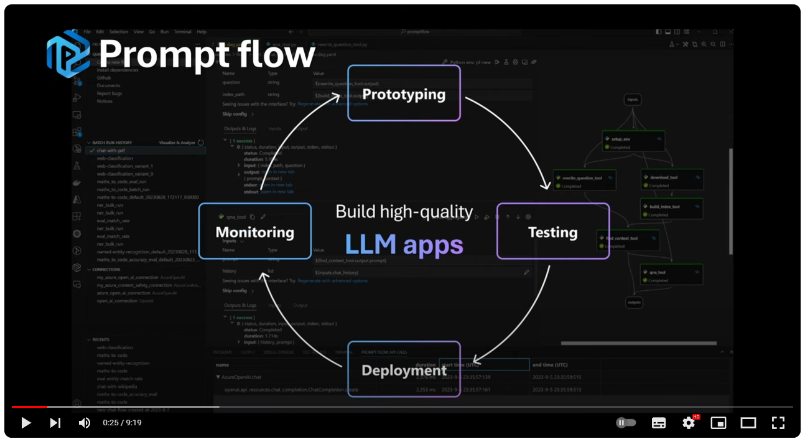
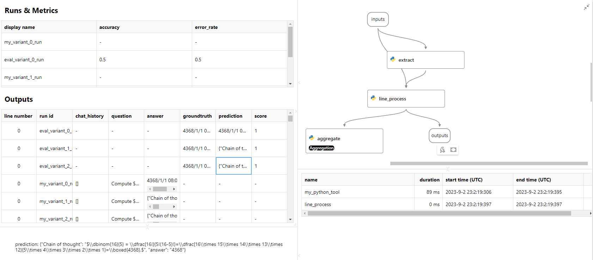

# Tutorial: How prompt flow helps on quality improvement

This tutorial is designed to enhance your understanding of improving flow quality through prompt tuning and evaluation.

Embark on a journey to overcome the inherent randomness of Language Models (LLMs) and enhance output reliability through **prompt fine-tuning** with this comprehensive tutorial. Explore how prompt flow can simplify this process, enabling you to swiftly build high-quality, LLM-native apps.

Prompt fine-tuning involves optimizing the input prompts given to an LLM. This strategic adjustment helps the model to focus on specific information needed for a task, thereby improving the accuracy and reliability of the LLM's responses.

When we talk about "high quality", it's not just about accuracy. It's equally important to strike a balance between the accuracy and the token cost of the LLM. Spend just 15 minutes with us to discover how prompt flow expedites the process of prompt tuning, testing, and evaluation, guiding you towards finding the ideal prompt **(accuracy ↑,token ↓)**


## Video tutorial

Before practicing, you can watch the video for a quick understand. This video shows how to use the **prompt flow VS code extension** to develop your chat flow, fine tune the prompt, batch test the flow, and evaluate the quality.

<a href="http://www.youtube.com/watch?feature=player_embedded&v=gcIe6nk2gA4
" target="_blank"></a>

## Hands-on practice

* Option 1 - VS Code Extension: [Install the prompt flow extension](https://marketplace.visualstudio.com/items?itemName=prompt-flow.prompt-flow) in VS Code and follow the [video tutorial](https://youtu.be/gcIe6nk2gA4) above for a guided practice.
* Option 2 - CLI：Follow the steps below to gain hands-on experience with the prompt flow CLI.

It's time to put theory into practice! Execute our sample and witness the effects.

### Prerequisite

Before moving ahead, ensure you've completed the [Quick Start](../../../README.md#get-started-with-prompt-flow-⚡) guidance. Ensure you have the following setup:
* [Install prompt flow](../../../README.md#installation)
* [Setup a connection for your API key](../../../README.md#quick-start-⚡)

> ℹ️ For testing quickly, this tutorial uses CLI command.

Clone the promptflow repository to your local machine:

```shell
git clone https://github.com/microsoft/promptflow.git
```

Setup sample `open_ai_connection` connection
```bash
# Override keys with --set to avoid yaml file changes
pf connection create --file ../../connections/azure_openai.yml --set api_key=<your_api_key> api_base=<your_api_base> --name open_ai_connection
```

Next, let's get started with customizing the flow for a specific task.

### Customize the flow for a specific task

In the `promptflow/examples/flows/chat` folder, you can see a `chat-basic` folder, which represents a chat template flow as same as the one you created in the [Quick Start](../../../README.md#get-started-with-prompt-flow-⚡) guidance. We'll use this flow as a starting point to build a math problem solver.

```bash
cd ../../flows/chat/chat-basic/
```

To enable your chatbot flow to solve math problems, you need to instruct the LLM about the task and target in the prompt. Open `chat.jinja2`, update the prompt as below:

```jinja
# system:
You are an assistant to calculate the answer to the provided math problems.
Please return the final numerical answer only, without any accompanying reasoning or explanation.


# user:
{{item.inputs.question}}
# assistant:
{{item.outputs.answer}}


# user:
{{question}}
```

Before run, check your connection settings in `flow.dag.yaml` file. The default connection name is `open_ai_connection`, and the default model is `gpt-3.5-turbo`. If you have a different connection name or model, please modify the `flow.dag.yaml` file accordingly.

><details>
><summary>(click to toggle details) For example, if you use Azure Open AI, please modify the `flow.dag.yaml` file to specify your connection and deployment</summary>
>
> Replace the 'node:' section with following content, specify the 'connection_name' to your Azure Open AI connection, and specify the 'deployment_name' to the model deployment you'd like to use.
> ```yaml
>nodes:
>- name: chat
>  type: llm
>  source:
>    type: code
>    path: chat.jinja2
>  inputs:
>    deployment_name: <your_azure_open_ai_deployment_name> #specify your deployment name
>    max_tokens: '256'
>    temperature: '0'
>    chat_history: ${inputs.chat_history}
>    question: ${inputs.question}
>  api: chat
>  connection: <your_azure_open_ai_connection_name> #specify your azure openai connection name
> ```
</details>

Go back to the `promptflow/examples/flows/chat` path, run the following command to test the flow with a simple math problem:

```bash
cd ..
pf flow test --flow ./chat-basic --inputs question="1+1=?"
```

This will yield the following output:
```json
{
    "answer": "2"
}
```

Sometime, the question may be challenging. Now, let's test it with a complex math problem, such as:

```bash
pf flow test --flow ./chat-basic --inputs question="We are allowed to remove exactly one integer from the list $$-1,0, 1, 2, 3, 4, 5, 6, 7, 8, 9, 10,11,$$and then we choose two distinct integers at random from the remaining list. What number should we remove if we wish to maximize the probability that the sum of the two chosen numbers is 10?"
```

The output is:
```json
{
    "answer": "-1"
}
```
However, the correct answer is 5, so the output answer is incorrect! (Don't be surprised if you got the correct answer, as the randiness of LLM. You can try multiple times for different answers.) It indicates that we need to further evaluate the performance. Therefore, in the next step, we will test the flow with more math problems to better evaluate the quality.

### Evaluate the quality of your prompt

With prompt flow, you can quickly trigger a batch-run to test your prompt with a larger dataset, and evaluate the quality of the answers.

There is a `data.jsonl` file in the `promptflow/examples/flows/chat/chat-math-variant` folder, which is a dataset containing 20 test data entries (a subset of [the Math Dataset](https://github.com/hendrycks/math/)). It includes the input question, the ground truth for numerical answer, and the reasoning (raw_answer). Here's one example:

```json
{
    "question": "Determine the number of ways to arrange the letters of the word PROOF.",
    "answer": "60",
    "raw_answer": "There are two O's and five total letters, so the answer is $\\dfrac{5!}{2!} = \\boxed{60}$."
}

```

Run the following command to test your prompt with this dataset:

First, set the environment variable `base_run_name` to specify the run name.

```bash
base_run_name="base_run"
```

<details>
<summary>For Windows CMD users, run commnad in toggle </summary>

```shell
set base_run_name=base_run
```

</details>


>ℹ️ The default model is `gpt-turbo-3.5`, let's try `gpt-4` to see if it's smarter to get better results. Use `--connections <node_name>.connection=<connection_name>...`to specify.

```bash
pf run create --flow ./chat-basic --data ./chat-math-variant/data.jsonl --column-mapping question='${data.question}' chat_history=[] --connections chat.connection=open_ai_connection chat.model=gpt-4 --stream --name $base_run_name
```

>ℹ️ For Azure Open AI, run the following command instead:
> ```shell
> pf run create --flow ./chat_math_variant --data test_data.jsonl --column-mapping question='${data.question}' chat_history=[] --connections chat.connection=azure_open_ai_connection chat.deployment_name=gpt-4 --stream --name $base_run_name
> ```

<details>
<summary>For Windows CMD users, run commnad in toggle</summary>

```shell
pf run create --flow ./chat-basic --data ./chat-math-variant/data.jsonl --column-mapping question='${data.question}' chat_history=[] --connections chat.connection=open_ai_connection chat.model=gpt-4 --stream --name %base_run_name%
```

</details>

> ℹ️ The run name must be unique. Please specify a new name in `--name`.
> If you see "Run 'base_run' already exists.", you can specify another name. But please remember the name you specified, because you'll need it in the next step.


When it completes, you can run the following command to see the details of results:
> Specify the run name of your completed run in `--name` argument:

```bash
pf run show-details --name $base_run_name
```

<details>
<summary>For Windows CMD users, run commnad in toggle</summary>

```shell
pf run show-details --name %base_run_name%
```

</details>

This can show the line by line input and output of the run:
```
+----+---------------+-----------------+---------------+---------------+
|    | inputs.chat   | inputs.question |   inputs.line | outputs.ans   |
|    | _history      |                 |       _number | wer           |
+====+===============+=================+===============+===============+
|  0 | []            | Compute $\dbi   |             0 | 4368          |
|    |               | nom{16}{5}$.    |               |               |
+----+---------------+-----------------+---------------+---------------+
|  1 | []            | Determine the   |             1 | 60            |
|    |               | number of       |               |               |
|    |               | ways to         |               |               |
|    |               | arrange the     |               |               |
|    |               | letters of      |               |               |
|    |               | the word        |               |               |
|    |               | PROOF.          |               |               |
+----+---------------+-----------------+---------------+---------------+
| .. | ...           | ...             |...            | ...           |
```

Next, create an **evaluation run** to calculate the accuracy of the answers based on the previous run.

In the `promptflow/examples/flows/evaluation` folder, you can see a `eval-chat-math` folder, which represents an evaluation flow. We'll use this flow to evaluate the accuracy of the answers.

```bash
cd ../evaluation
```

Run the following command to create an evaluation run:

```bash
eval_run_name="eval_run"
pf run create --flow ./eval-chat-math --data ../chat/chat-math-variant/data.jsonl --column-mapping groundtruth='${data.answer}' prediction='${run.outputs.answer}' --stream --run $base_run_name --name $eval_run_name
```

<details>
<summary>For Windows CMD users, run commnad in toggle</summary>

```shell
set eval_run_name=eval_run
pf run create --flow ./eval-chat-math --data ../chat/chat-math-variant/data.jsonl --column-mapping groundtruth='${data.answer}' prediction='${run.outputs.answer}' --run %base_run_name% --name %eval_run_name% --stream
```

</details>

> If needed, specify the run name which you want to evaluate in `--run` argument, and specify this evaluation run name in `--name` argument.

Then get metrics of the `eval_run`:

```bash
pf run show-metrics --name $eval_run_name
```

<details>
<summary>For Windows CMD users, run commnad in toggle</summary>

```shell
pf run show-details --name %eval_run_name%
```

</details>

You can visualize and compare the output line by line of `base_run` and `eval_run` in a web browser:

```bash
pf run visualize --name "$base_run_name,$eval_run_name"
```

<details>
<summary>For Windows CMD users, run commnad in toggle</summary>

```shell
pf run visualize --name "%base_run_name%,%eval_run_name%"
```

</details>

Because of the randomness of the LLM, the accuracy may vary. For example, in my run, the metrics are as follows:

```json
{
    "accuracy": 0.35,
    "error_rate": 0.65
}
```

Oops! The accuracy isn't satisfactory. It's time to fine-tune your prompt for higher quality!

### Fine-tuning your prompt and evaluate the improvement

In the `/chat` folder, you can see a `chat-math-variant` folder, which represents a flow with two additional prompt variants compared to the original one you customized based on the `chat-basic`.

In this sample flow, you'll find three Jinja files:
* `chat.jinja2` is the original prompt as same as the one you customized in `chat-basic`.
* `chat_variant_1.jinja2` and `chat_variant_2.jinja2` are the 2 additional prompt variants.

We leverage the Chain of Thought (CoT) prompt engineering method to adjust the prompt. The goal is to activate the Language Model's reasoning capability of the questions, by providing a few CoT examples.

<details>
<summary>Variant_1: 2 CoT examples</summary>

```jinja
# system:
You are an assistant to calculate the answer to the provided math problems.
Please think step by step.
Return the final numerical answer only and any accompanying reasoning or explanation seperately as json format. <br>
# user:
A jar contains two red marbles, three green marbles, ten white marbles and no other marbles. Two marbles are randomly drawn from this jar without replacement. What is the probability that these two marbles drawn will both be red? Express your answer as a common fraction.
# assistant:
{Chain of thought: "The total number of marbles is $2+3+10=15$.  The probability that the first marble drawn will be red is $2/15$.  Then, there will be one red left, out of 14.  Therefore, the probability of drawing out two red marbles will be: $$\\frac{2}{15}\\cdot\\frac{1}{14}=\\boxed{\\frac{1}{105}}$$.", "answer": "1/105"}
# user:
Find the greatest common divisor of $7!$ and $(5!)^2.$
# assistant:
{"Chain of thought": "$$ \\begin{array} 7! &=& 7 \\cdot 6 \\cdot 5 \\cdot 4 \\cdot 3 \\cdot 2 \\cdot 1 &=& 2^4 \\cdot 3^2 \\cdot 5^1 \\cdot 7^1 \\\\ (5!)^2 &=& (5 \\cdot 4 \\cdot 3 \\cdot 2 \\cdot 1)^2 &=& 2^6 \\cdot 3^2 \\cdot 5^2 \\\\ \\text{gcd}(7!, (5!)^2) &=& 2^4 \\cdot 3^2 \\cdot 5^1 &=& \\boxed{720} \\end{array} $$.", "answer": "720"}
```
</details>

<details>
<summary>Variant_2 : 6 CoT examples.</summary>

```jinja
# system:
You are an assistant to calculate the answer to the provided math problems.
Please think step by step.
Return the final numerical answer only and any accompanying reasoning or explanation seperately as json format.

# user:
A jar contains two red marbles, three green marbles, ten white marbles and no other marbles. Two marbles are randomly drawn from this jar without replacement. What is the probability that these two marbles drawn will both be red? Express your answer as a common fraction.
# assistant:
{Chain of thought: "The total number of marbles is $2+3+10=15$.  The probability that the first marble drawn will be red is $2/15$.  Then, there will be one red left, out of 14.  Therefore, the probability of drawing out two red marbles will be: $$\\frac{2}{15}\\cdot\\frac{1}{14}=\\boxed{\\frac{1}{105}}$$.", "answer": "1/105"}
# user:
Find the greatest common divisor of $7!$ and $(5!)^2.$
# assistant:
{"Chain of thought": "$$ \\begin{array} 7! &=& 7 \\cdot 6 \\cdot 5 \\cdot 4 \\cdot 3 \\cdot 2 \\cdot 1 &=& 2^4 \\cdot 3^2 \\cdot 5^1 \\cdot 7^1 \\\\ (5!)^2 &=& (5 \\cdot 4 \\cdot 3 \\cdot 2 \\cdot 1)^2 &=& 2^6 \\cdot 3^2 \\cdot 5^2 \\\\ \\text{gcd}(7!, (5!)^2) &=& 2^4 \\cdot 3^2 \\cdot 5^1 &=& \\boxed{720} \\end{array} $$.", "answer": "720"}
# user:
A club has 10 members, 5 boys and 5 girls.  Two of the members are chosen at random.  What is the probability that they are both girls?
# assistant:
{"Chain of thought": "There are $\\binomial{10}{2} = 45$ ways to choose two members of the group, and there are $\\binomial{5}{2} = 10$ ways to choose two girls.  Therefore, the probability that two members chosen at random are girls is $\\dfrac{10}{45} = \\boxed{\\dfrac{2}{9}}$.", "answer": "2/9"}
# user:
Allison, Brian and Noah each have a 6-sided cube. All of the faces on Allison's cube have a 5. The faces on Brian's cube are numbered 1, 2, 3, 4, 5 and 6. Three of the faces on Noah's cube have a 2 and three of the faces have a 6. All three cubes are rolled. What is the probability that Allison's roll is greater than each of Brian's and Noah's? Express your answer as a common fraction.
# assistant:
{"Chain of thought": "Since Allison will always roll a 5, we must calculate the probability that both Brian and Noah roll a 4 or lower. The probability of Brian rolling a 4 or lower is $\\frac{4}{6} = \\frac{2}{3}$ since Brian has a standard die. Noah, however, has a $\\frac{3}{6} = \\frac{1}{2}$ probability of rolling a 4 or lower, since the only way he can do so is by rolling one of his 3 sides that have a 2. So, the probability of both of these independent events occurring is $\\frac{2}{3} \\cdot \\frac{1}{2} = \\boxed{\\frac{1}{3}}$.", "answer": "1/3"}
# user:
Compute $\\density binomial{50}{2}$.
# assistant:
{"Chain of thought": "$\\density binomial{50}{2} = \\dfrac{50!}{2!48!}=\\dfrac{50\\times 49}{2\\times 1}=\\boxed{1225}.$", "answer": "1225"}
# user:
The set $S = \\{1, 2, 3, \\ldots , 49, 50\\}$ contains the first $50$ positive integers.  After the multiples of 2 and the multiples of 3 are removed, how many integers remain in the set $S$?
# assistant:
{"Chain of thought": "The set $S$ contains $25$ multiples of 2 (that is, even numbers).  When these are removed, the set $S$ is left with only the odd integers from 1 to 49. At this point, there are $50-25=25$ integers in $S$. We still need to remove the multiples of 3 from $S$.\n\nSince $S$ only contains odd integers after the multiples of 2 are removed,  we must remove the odd multiples of 3 between 1 and 49.  These are 3, 9, 15, 21, 27, 33, 39, 45, of which there are 8.  Therefore, the number of integers remaining in the set $S$ is $25 - 8 = \\boxed{17}$.", "answer": "17"}
```
</details>

These two jinja files are specified in the `flow.dag.yaml` file, which defines the flow structure. You can see that the `chat` node has 3 variants, which point to these 3 Jinja files.

### Test and evaluate your prompt variants

First, you need to modify your flow to add two more prompt variants into the chat node, in addition to the existed default one. In the flow.dag.yaml file, you can see 3 variants definition of the `chat` node, which point to these 3 Jinja files.

Run the CLI command below to start the experiment: test all variants, evaluate them, get the visualized comparison results of the experiment.

> ℹ️ By default, the connection is set to `open_ai_connection` and and the model is set to `gpt-4` for each variant, as specified in the `flow.dag.yaml` file. However, you have the flexibility to specify a different connection and model by adding `--connections chat.connection=<your_connection_name> chat.deployment_name=<model_name>` in the test run command.

Navigate to the `promptflow/examples/flows` folder

```bash
cd ..
```

Set the environment variable `base_run_name` and `eval_run_name` to specify the run name.

```bash
base_run_name="base_run_variant_"
eval_run_name="eval_run_variant_"
```

<details>
<summary>For Windows CMD users, run commnad in toggle</summary>

```shell
set base_run_name=base_run_variant_
set eval_run_name=eval_run_variant_
```

</details>

Run the following command to test and evaluate the variants:

```bash
# Test and evaluate variant_0:
# Test-run
pf run create --flow ./chat/chat-math-variant --data ./chat/chat-math-variant/data.jsonl --column-mapping question='${data.question}' chat_history=[] --variant '${chat.variant_0}' --stream  --name "${base_run_name}0"
# Evaluate-run
pf run create --flow ./evaluation/eval-chat-math --data ./chat/chat-math-variant/data.jsonl --column-mapping groundtruth='${data.answer}' prediction='${run.outputs.answer}' --stream --run "${base_run_name}0" --name "${eval_run_name}0"

# Test and evaluate variant_1:
# Test-run
pf run create --flow ./chat/chat-math-variant --data ./chat/chat-math-variant/data.jsonl --column-mapping question='${data.question}' chat_history=[] --variant '${chat.variant_1}' --stream --name "${base_run_name}1"
# Evaluate-run
pf run create --flow ./evaluation/eval-chat-math --data ./chat/chat-math-variant/data.jsonl --column-mapping groundtruth='${data.answer}' prediction='${run.outputs.answer}' --stream --run "${base_run_name}1" --name "${eval_run_name}1"

# Test and evaluate variant_2:
# Test-run
pf run create --flow ./chat/chat-math-variant --data ./chat/chat-math-variant/data.jsonl --column-mapping question='${data.question}' chat_history=[] --variant '${chat.variant_2}' --stream --name "${base_run_name}2"
# Evaluate-run
pf run create --flow ./evaluation/eval-chat-math --data ./chat/chat-math-variant/data.jsonl --column-mapping groundtruth='${data.answer}' prediction='${run.outputs.answer}' --stream --run "${base_run_name}2" --name "${eval_run_name}2"
```

<!-- > If encounter the 'execution timeout' error, just try again. It might be caused by the LLM service congestion. -->

<details>
<summary>For Windows CMD users, run commnad in toggle</summary>

```shell
# Test and evaluate variant_0:
# Test-run
pf run create --flow ./chat/chat-math-variant --data ./chat/chat-math-variant/data.jsonl --column-mapping question='${data.question}' chat_history=[] --variant '${chat.variant_0}' --stream --name %base_run_name%0
# Evaluate-run
pf run create --flow ./evaluation/eval-chat-math --data ./chat/chat-math-variant/data.jsonl --column-mapping groundtruth='${data.answer}' prediction='${run.outputs.answer}' --stream --run %base_run_name%0 --name %eval_run_name%0

# Test and evaluate variant_1:
# Test-run
pf run create --flow ./chat/chat-math-variant --data ./chat/chat-math-variant/data.jsonl --column-mapping question='${data.question}' chat_history=[] --variant '${chat.variant_1}' --stream --name %base_run_name%1
# Evaluate-run
pf run create --flow ./evaluation/eval-chat-math --data ./chat/chat-math-variant/data.jsonl --column-mapping groundtruth='${data.answer}' prediction='${run.outputs.answer}' --stream --run %base_run_name%1 --name %eval_run_name%1

# Test and evaluate variant_2:
# Test-run
pf run create --flow ./chat/chat-math-variant --data ./chat/chat-math-variant/data.jsonl --column-mapping question='${data.question}' chat_history=[] --variant '${chat.variant_2}' --stream --name %base_run_name%2
# Evaluate-run
pf run create --flow ./evaluation/eval-chat-math --data ./chat/chat-math-variant/data.jsonl --column-mapping groundtruth='${data.answer}' prediction='${run.outputs.answer}' --stream --run %base_run_name%2 --name %eval_run_name%2
```

</details>

Get metrics of the all evaluations:

```bash
pf run show-metrics --name "${eval_run_name}0"
pf run show-metrics --name "${eval_run_name}1"
pf run show-metrics --name "${eval_run_name}2"
```

You may get the familiar output like this:
```
# eval_variant_0_run
{
    "accuracy": 0.3,
    "error_rate": 0.7
}
# eval_variant_1_run
{
    "accuracy": 0.9,
    "error_rate": 0.1
}
# eval_variant_2_run
{
    "accuracy": 0.9,
    "error_rate": 0.1
}
```

Visualize the results:

```bash
pf run visualize --name "${base_run_name}0,${eval_run_name}0,${base_run_name}1,${eval_run_name}1,${base_run_name}2,${eval_run_name}2"
```

<details>
<summary>For Windows CMD users, run commnad in toggle</summary>

```shell
pf run visualize --name "%base_run_name%0,%eval_run_name%0,base_run_name%1,%eval_run_name%1,base_run_name%2,%eval_run_name%2"
```

</details>

Click the HTML link, to get the experiment results. Click on column in the **Output** table will allow you to view the snapshot of each line.

The snapshot of chat flow:


The snapshot of evaluation flow:


Excellent! Now you can compare their performances and token costs, and choose the prompt that best suits your needs. We can see that variant_1 and variant_2 have the same accuracy, but variant_1 has a lower token cost (only 2 few shots rather than the 6 in in variant_2). So variant_1 is the best choice for the quality and cost balance.

### Conclusion

Great! Now you can compare their performances and token costs to choose the prompt that best suits your needs. Upon comparison, we can observe that variant_1 and variant_2 have the similar accuracy. However, variant_1 stands out as the better choice due to its lower token cost (2 few-shots vs. 6 few-shots).


It is evident that adding more CoT examples in the prompt does not necessarily improve the accuracy further. Instead, we should identify the optimal point where the number of shots maximizes accuracy while minimizing cost.

Just in a few steps, we identified that variant_1 strikes the ideal balance between quality and cost! This is where the value of prompt tuning and evaluation using prompt flow becomes apparent. With prompt flow, you can easily test and evaluate different prompt variants, enabling you to facilitate high quality LLM-native apps to production.
