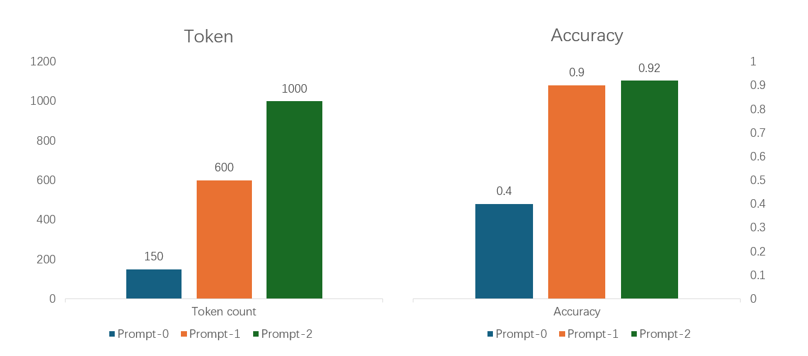

# Tutorial: Prompt tuning and evaluation

## Prerequisite

Before moving ahead, ensure you've completed the [Quick Start](../../../README.md#get-started-with-prompt-flow-⚡) tutorial.

This tutorial also uses the `my_chatbot flow` as an example. To begin, create a `pf-test` folder and initialize `my_chatbot` within it:

```sh
mkdir pf-test
cd pf-test
pf flow init --flow ./my_chatbot --type chat  # initiate a flow using the chat template
```

> ℹ️ For expedited testing, this tutorial utilizes CLI command.

## Customize the Flow for a Specific Task
 
To enable your chatbot flow to solve math problems, you need to instruct the LLM about the task and target in the prompt. For this, we'll tweak the prompt in `chat.jinja2` file in the my_chatbot folder.

Open `chat.jinja2` and overwrite its content with the following prompt. Note that tasks and targets are highlighted in the system prompt:

```jinja2
system:
You are an assistant to calculate the answer to the provided math problems. Please return the final numerical answer only, without any accompanying reasoning or explanation.


user:
{{item.inputs.question}}
assistant:
{{item.outputs.answer}}


user:
{{question}}
```

You should see an output similar to the following:

```sh
pf flow test --flow ./my_chatbot --inputs question=1+1=?
```
Then you will get the following output, for example:
```sh
2023-09-03 14:21:23 +0800   77320 execution          INFO     Start to run 1 nodes with concurrency level 16.
2023-09-03 14:21:23 +0800   77320 execution.flow     INFO     Executing node chat. node run id: 990b3eb7-396d-474d-baf3-0123ab1d3705_chat_0
2023-09-03 14:21:25 +0800   77320 execution.flow     INFO     Node chat completes.
{
    "answer": "2"
}
```

You can test it with a complex math problem again, such as:

```sh
pf flow test --flow ./my_chatbot --inputs question="James has 7 apples. 4 of them are red, and 3 of them are green. If he chooses 2 apples at random, what is the probability that both the apples he chooses are green?"
```
The output should be like this:
```sh
2023-09-03 14:22:36 +0800   59596 execution          INFO     Start to run 1 nodes with concurrency level 16.
2023-09-03 14:22:36 +0800   59596 execution.flow     INFO     Executing node chat. node run id: f4e15bdb-3392-4c88-b02e-7af42ddc9f68_chat_0
2023-09-03 14:22:37 +0800   59596 execution.flow     INFO     Node chat completes.
{
    "answer": "1/21"
}
```

Congratulations! The LLM has successfully solved the math problem and returned the numerical answer.

Next, let's test it with more questions and evaluate the quality of the flow.

## Evaluate the quality of your prompt

To evaluate the performance of the flow, you can use a larger dataset for testing.

> 📥 Click to [download the test dataset](./tune-your-prompt-samples/test_data.jsonl), and place it in the `pf-test` folder.

The dataset is a JSONL file containing 20 test data entries, which include the input question, the ground truth for numerical answer, and the reasoning. Here's an example:

```json
{
    "question": "Determine the number of ways to arrange the letters of the word PROOF.", // input question
    "answer": "60", // ground truth for numerical answer
    "raw_answer": "There are two O's and five total letters, so the answer is $\\dfrac{5!}{2!} = \\boxed{60}$." // ground truth for reasoning
}

```

Run the following command to test your prompt with this dataset:

The default model is `gpt-turbo-3.5`, let's try `gpt-4` to see if it's smarter to get better results:

```sh
pf run create --flow ./my_chatbot --data test_data.jsonl --column-mapping question='${data.question}' chat_history=[] --name base_run --connections chat.connection=open_ai_connection chat.model=gpt-4 --stream
```

> 🧰 Troubleshooting:
> * UserErrorException: Column mapping must contain at least one mapping binding.
>   * (For CMD users) Try to use double quotes instead of single quotes in the `column-mapping` argument (e.g. `--column-mapping question="${data.question}"`).
> * RunExistsError: Run 'base_run' already exists.
>     * The run name must be unique.Please specify a new name in `--name`. You can run the command without specifying `--name` to generate a random run name, which you can find in the log output, in `Run name` section.
> * CMD users should also use the absolute path (e.g., `--data C:\Users\test\pf-test\test_data.jsonl`and `--flow C:\Users\test\pf-test\my_chatbot`).

The log output should be like this:

```
......
2023-09-02 16:16:25 +0800   98288 execution          INFO     Process 4 queue empty, exit.
======= Run Summary =======

Run name: "my_chatbot_default_20230902_161602_591557"
Run status: "Completed"
Start time: "2023-09-02 16:16:02.336443"
Duration: "0:00:22.832404"
......
```

To see the run details, run the following command, specify the run name of your completed run in `--name` argument:
```sh
pf run show-details --name base_run
```
This can show the line by line input and output of the run:
```
+----+---------------+-----------------+---------------+---------------+
|    | inputs.chat   | inputs.questi   |   inputs.line | outputs.ans   |
|    | _history      | on              |       _number | wer           |
+====+===============+=================+===============+===============+
|  0 | []            | Compute $\dbi   |             0 | 4368          |
|    |               | nom{16}{5}$.    |               |               |
+----+---------------+-----------------+---------------+---------------+
|  1 | []            | Determine the   |             1 | 60            |
|    |               | number of       |               |               |
|    |               | ways to         |               |               |
|    |               | arrange the     |               |               |
|    |               | letters of      |               |               |
|    |               | the word        |               |               |
|    |               | PROOF.          |               |               |
+----+---------------+-----------------+---------------+---------------+
| .. | ...           | ...             |...            | ...           |
```

Next, run an **evaluation flow** to calculate the accuracy of the answers based on the previous run:

> 📥 Click to [download the evaluation flow](./src/eval_accuracy.zip), unzip it, then put the flow folder in the `pf-test` folder.

```sh
pf run create --flow ./eval_accuracy --data test_data.jsonl --column-mapping groundtruth='${data.answer}' prediction='${run.outputs.answer}' --run base_run --name eval_run --stream
```

Then get metrics of the `eval_run` (specify another customized or random run name in `--name` argument):
```sh
pf run show-metrics --name eval_run
```

You can visualize and compare the output line by line of `base_run` and `eval_run` in a web browser:

```sh
pf run visualize --name 'base_run,eval_run'
```

Because of the randomness of the LLM, the accuracy may vary. For example, in my run, the metrics are as follows:

```
{
    "accuracy": 0.35,
    "error_rate": 0.65
}
```

Opps! The accuracy isn't satisfactory. It's time to fine-tune your prompt for higher quality!

## Fine-tuning your prompt and evaluate the improvement

To improve the quality of your prompt, you can conduct an experiment to test your ideas.
> 📥 Click to [download the chat flow](./src/my_chatbot_variant.zip). Unzip it and place the `my_chatbot_variant` folder inside the `pf-test` folder.

In this sample flow, you'll find three Jinja files: `chat.jinja2`, `chat_variant_1.jinja2` and `chat_variant_2.jinja2`. These represent three prompt variants.

We leverage the Chain of Thought (CoT) prompt engineering method to adjust the prompt. The goal is to activate the Language Model's reasoning capability of the questions, by providing a few CoT examples.

Variant_0: the origin prompt
```
system:
You are a helpful assistant. Help me with some mathematics problems of counting and probability. Please provide the result number only in your response.

user:
{{item.inputs.question}}
assistant:
{{item.outputs.answer}}

user:
{{question}}
```

Variant_1: 2 CoT examples

```
system:
You are a helpful assistant. Help me with some mathematics problems of counting and probability. Think step by step and output as json format.
Here are some examples:
user:
A jar contains two red marbles, three green marbles, ten white marbles and no other marbles. Two marbles are randomly drawn from this jar without replacement. What is the probability that these two marbles drawn will both be red? Express your answer as a common fraction.
assistant:
{Chain of thought: "The total number of marbles is $2+3+10=15$.  The probability that the first marble drawn will be red is $2/15$.  Then, there will be one red left, out of 14.  Therefore, the probability of drawing out two red marbles will be: $$\\frac{2}{15}\\cdot\\frac{1}{14}=\\boxed{\\frac{1}{105}}$$.", "answer": "1/105"}
user:
Find the greatest common divisor of $7!$ and $(5!)^2.$
assistant:
{"Chain of thought": "$$ \\begin{array}{rcrcr} 7! &=& 7 \\cdot 6 \\cdot 5 \\cdot 4 \\cdot 3 \\cdot 2 \\cdot 1 &=& 2^4 \\cdot 3^2 \\cdot 5^1 \\cdot 7^1 \\\\ (5!)^2 &=& (5 \\cdot 4 \\cdot 3 \\cdot 2 \\cdot 1)^2 &=& 2^6 \\cdot 3^2 \\cdot 5^2 \\\\ \\text{gcd}(7!, (5!)^2) &=& 2^4 \\cdot 3^2 \\cdot 5^1 &=& \\boxed{720} \\end{array} $$.", "answer": "720"}

user:
{{item.inputs.question}}
assistant:
{{item.outputs.answer}}

user:
{{question}}
```

Variant_2 : 6 CoT examples.
```
system:
You are a helpful assistant. Help me with some mathematics problems of counting and probability. Think step by step and output as json format.

Here are some examples:

user:
A jar contains two red marbles, three green marbles, ten white marbles and no other marbles. Two marbles are randomly drawn from this jar without replacement. What is the probability that these two marbles drawn will both be red? Express your answer as a common fraction.
assistant:
{Chain of thought: "The total number of marbles is $2+3+10=15$.  The probability that the first marble drawn will be red is $2/15$.  Then, there will be one red left, out of 14.  Therefore, the probability of drawing out two red marbles will be: $$\\frac{2}{15}\\cdot\\frac{1}{14}=\\boxed{\\frac{1}{105}}$$.", "answer": "1/105"}
user:
Find the greatest common divisor of $7!$ and $(5!)^2.$
assistant:
{"Chain of thought": "$$ \\begin{array}{rcrcr} 7! &=& 7 \\cdot 6 \\cdot 5 \\cdot 4 \\cdot 3 \\cdot 2 \\cdot 1 &=& 2^4 \\cdot 3^2 \\cdot 5^1 \\cdot 7^1 \\\\ (5!)^2 &=& (5 \\cdot 4 \\cdot 3 \\cdot 2 \\cdot 1)^2 &=& 2^6 \\cdot 3^2 \\cdot 5^2 \\\\ \\text{gcd}(7!, (5!)^2) &=& 2^4 \\cdot 3^2 \\cdot 5^1 &=& \\boxed{720} \\end{array} $$.", "answer": "720"}
user:
A club has 10 members, 5 boys and 5 girls.  Two of the members are chosen at random.  What is the probability that they are both girls?
assistant:
{"Chain of thought": "There are $\\binom{10}{2} = 45$ ways to choose two members of the group, and there are $\\binom{5}{2} = 10$ ways to choose two girls.  Therefore, the probability that two members chosen at random are girls is $\\dfrac{10}{45} = \\boxed{\\dfrac{2}{9}}$.", "answer": "2/9"}
user:
Allison, Brian and Noah each have a 6-sided cube. All of the faces on Allison's cube have a 5. The faces on Brian's cube are numbered 1, 2, 3, 4, 5 and 6. Three of the faces on Noah's cube have a 2 and three of the faces have a 6. All three cubes are rolled. What is the probability that Allison's roll is greater than each of Brian's and Noah's? Express your answer as a common fraction.
assistant:
{"Chain of thought": "Since Allison will always roll a 5, we must calculate the probability that both Brian and Noah roll a 4 or lower. The probability of Brian rolling a 4 or lower is $\\frac{4}{6} = \\frac{2}{3}$ since Brian has a standard die. Noah, however, has a $\\frac{3}{6} = \\frac{1}{2}$ probability of rolling a 4 or lower, since the only way he can do so is by rolling one of his 3 sides that have a 2. So, the probability of both of these independent events occurring is $\\frac{2}{3} \\cdot \\frac{1}{2} = \\boxed{\\frac{1}{3}}$.", "answer": "1/3"}
user:
Compute $\\dbinom{50}{2}$.
assistant:
{"Chain of thought": "$\\dbinom{50}{2} = \\dfrac{50!}{2!48!}=\\dfrac{50\\times 49}{2\\times 1}=\\boxed{1225}.$", "answer": "1225"}
user:
The set $S = \\{1, 2, 3, \\ldots , 49, 50\\}$ contains the first $50$ positive integers.  After the multiples of 2 and the multiples of 3 are removed, how many integers remain in the set $S$?
assistant:
{"Chain of thought": "The set $S$ contains $25$ multiples of 2 (that is, even numbers).  When these are removed, the set $S$ is left with only the odd integers from 1 to 49. At this point, there are $50-25=25$ integers in $S$. We still need to remove the multiples of 3 from $S$.\n\nSince $S$ only contains odd integers after the multiples of 2 are removed,  we must remove the odd multiples of 3 between 1 and 49.  These are 3, 9, 15, 21, 27, 33, 39, 45, of which there are 8.  Therefore, the number of integers remaining in the set $S$ is $25 - 8 = \\boxed{17}$.", "answer": "17"}

user:
{{item.inputs.question}}
assistant:
{{item.outputs.answer}}

user:
{{question}}
```

## Test and evaluate your prompt variants

First, you need to modify your flow to add two more prompt variants into the chat node, in addition to the existed default one. In the flow.dag.yaml file, you can see 3 variants definition of the `chat` node, which point to these 3 Jinjia files.

Run the CLI command below to start the experiment: test all variants, evaluate them, get the visualized comparison results of the experiment.

> ℹ️ By default, the connection is set to `open_ai_connection` and and the model is set to `gpt-4` for each variant, as specified in the `flow.dag.yaml` file. However, you have the flexibility to specify a different connection and model by adding `--connections chat.connection=<your_connection_name> chat.model=<model_name>` in the test run command.

Test and evaluate variant_0:
```sh
# Test-run
pf run create --flow ./my_chatbot_variant --data test_data.jsonl --column-mapping question='${data.question}' chat_history=[] --variant '${chat.variant_0}' --name my_variant_0_run --stream 
```
```sh
# Evaluate-run
pf run create --flow ./eval_accuracy --data test_data.jsonl --column-mapping groundtruth='${data.answer}' prediction='${run.outputs.answer}' --run my_variant_0_run --name eval_variant_0_run --stream
```

Test and evaluate variant_1:
```sh
# Test-run
pf run create --flow ./my_chatbot_variant --data test_data.jsonl --column-mapping question='${data.question}' chat_history=[] --variant '${chat.variant_1}' --stream --name my_variant_1_run
```
```sh
# Evaluate-run
pf run create --flow ./eval_accuracy --data test_data.jsonl --column-mapping groundtruth='${data.answer}' prediction='${run.outputs.answer}' --run my_variant_1_run --name eval_variant_1_run --stream
```

Test and evaluate variant_2:
```sh
# Test-run
pf run create --flow ./my_chatbot_variant --data test_data.jsonl --column-mapping question='${data.question}' chat_history=[] --variant '${chat.variant_2}' --stream --name my_variant_2_run
```
```sh
# Evaluate-run
pf run create --flow ./eval_accuracy --data test_data.jsonl --column-mapping groundtruth='${data.answer}' prediction='${run.outputs.answer}' --run my_variant_2_run --name eval_variant_2_run --stream
```

Get metrics of the all evaluations:
```sh
pf run show-metrics --name eval_variant_0_run
pf run show-metrics --name eval_variant_1_run
pf run show-metrics --name eval_variant_2_run
```

You may get the familiar output like this:
```sh
# eval_variant_0_run
{
    "accuracy": 0.3, 
    "error_rate": 0.7
}
# eval_variant_1_run
{
    "accuracy": 0.9,
    "error_rate": 0.1
}
# eval_variant_2_run
{
    "accuracy": 0.9,
    "error_rate": 0.1
}
```

Visualize the results:
```sh
pf run visualize --name 'my_variant_0_run,eval_variant_0_run,my_variant_1_run,eval_variant_1_run,my_variant_2_run,eval_variant_2_run'
```

> 🧰 Troubleshooting:
> * RunNotFoundError: Run name "'my_variant_0_run" cannot be found..
>   * (For CMD users) Try to use double quotes instead of single quotes in the `--name` argument.

Click the HTML link, to get the experiment results. Click on column in the **Output** table will allow you to view the snapshot of each line.

The snapshot of chat flow:


The snapshot of evaluation flow:


Excellent! Now you can compare their performances and token costs, and choose the prompt that best suits your needs. We can see that variant_1 and variant_2 have the same accuracy, but variant_1 has a lower token cost (only 2 few shots rather than the 6 in in variant_2). So variant_1 is the best choice for the quality and cost balance.

## Conclusion

Great! Now you can compare their performances and token costs to choose the prompt that best suits your needs. Upon comparison, we can observe that variant_1 and variant_2 have the similar accuracy. However, variant_1 stands out as the better choice due to its lower token cost (2 few-shots vs. 6 few-shots).



It is evident that adding more CoT examples in the prompt does not necessarily improve the accuracy further. Instead, we should identify the optimal point where the number of shots maximizes accuracy while minimizing cost.

Just in a few steps, we identified that variant_1 strikes the ideal balance between quality and cost! This is where the value of prompt tuning and evaluation using prompt flow becomes apparent. With prompt flow, you can easily test and evaluate different prompt variants, enabling you to facilitate high quality LLM-native apps to production.