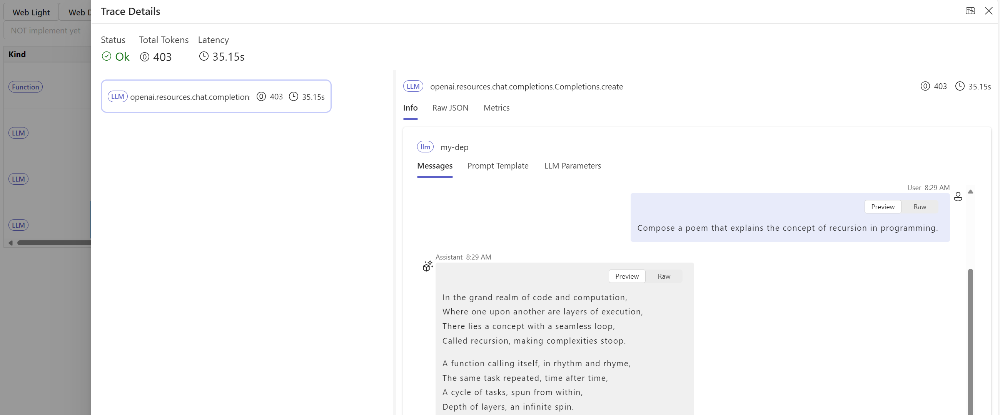

## Installation
* Install promptflow private wheel:
```cmd
pip install "promptflow==0.0.119481577" --extra-index-url https://azuremlsdktestpypi.azureedge.net/test-promptflow/
```
* Enable internal features in your conda env
```cmd
pf config set enable_internal_features=true
```

## Traces
Today, DAG prompt flow has a way to track and visualize node level inputs/outputs of flow execution, it provides critical insights for developer to understand the internal details of execution. While more developers are using different frameworks (langchain, semantic kernel, OpenAI, kinds of agents) to create LLM based applications. To benefit these non-DAG-flow developers, prompt flow provides the trace feature to capture and visualize the internal execution details. 
### LLM Trace
* `start_trace()` to enable trace for LLM calls

Let's start with the simplest example, add single line code to enable trace for LLM calls in your application.
```python
from openai import OpenAI
import promptflow as pf

# start_trace() will print a url for trace detail visualization 
pf.start_trace()

client = OpenAI()

completion = client.chat.completions.create(
  model="gpt-4",
  messages=[
    {"role": "system", "content": "You are a poetic assistant, skilled in explaining complex programming concepts with creative flair."},
    {"role": "user", "content": "Compose a poem that explains the concept of recursion in programming."}
  ]
)

print(completion.choices[0].message)
```

With the trace url, user will see a trace list that corresponding to each LLM calls:


Click on line record, the LLM detail will be displayed with chat window experience, together with other LLM call params:


* `@trace` to add your own trace for any function
More common scenario is the application has complicated code structure, and developer would like to add trace on critical path that they would like to 

There're more examples of using 


### Flow Traces
### Evaluate against batch data
