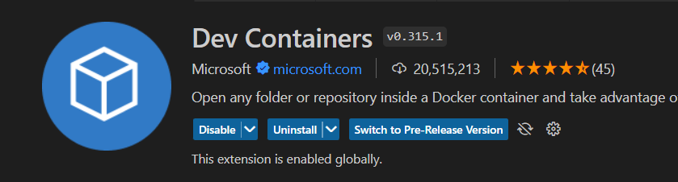

# Devcontainer for promptflow
To facilitate your promptflow project development and empower you to work on LLM projects using promptflow more effectively, 
we've configured the necessary environment for developing promptflow projects and utilizing flows through the dev container feature. 
You can seamlessly initiate your promptflow project development and start leveraging flows by simply using the dev container feature via VS Code or Codespaces.

## Use Github Codespaces
Use codespaces to open promptflow repo, it will automatically build the dev containers environment and open promptflow with dev containers. You can just click: 

## Use local devcontainer
Use vscode to open promptflow repo, and install vscode extension: Dev Containers and then open promptflow with dev containers. 
  
**About dev containers please refer to: [dev containers](https://code.visualstudio.com/docs/devcontainers/containers)**

