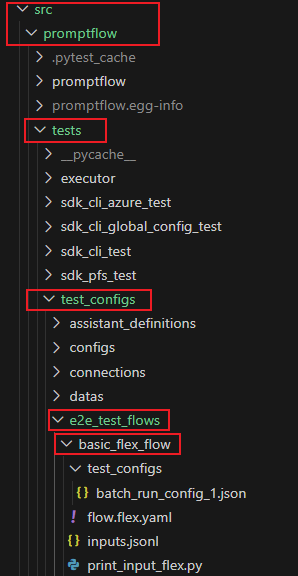

# How to add e2e test cases using the test framrwork?

This document is mainly used to introduce how to use the new test framework (in ADO repo) to add the gated e2e scenarios tests.

## Steps:

1. Add the test flow folder under `src/promptflow/tests/test_configs/e2e_test_flows`


2. Add the test_config folder under the flow folder.
Please follow the file naming convention to add a test.
- **Flow test:** Name the test config file starting with `flow_test_config_`, followed by any name, which can be a number or a brief description of the test cases, eg. flow_test_config_1.json.
- **Single node run:** Name the test config file starting with `single_node_run_config_`, followed by any name, which can be a number or a brief description of the test cases, eg. single_node_run_config_1.json.
- **Batch run:** Name the test config file starting with `batch_run_config_`, followed by any name, which can be a number or a brief description of the test cases, eg. batch_run_config_1.json.

3. Fill the test config json file with following fields.
``` json

```